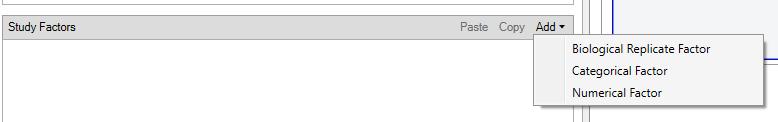
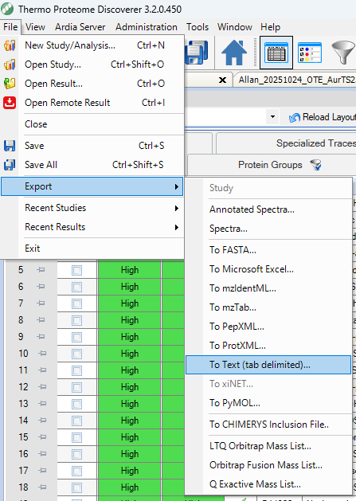
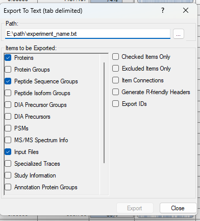

# Tutorial 1: Importing Data
[](https://github.com/gnaprs/scpviz/raw/main/docs/tutorials/importing.ipynb)
[](https://colab.research.google.com/github/gnaprs/scpviz/blob/main/docs/tutorials/importing.ipynb)

This tutorial shows how to import **DIA-NN** or **Proteome Discoverer (PD)** outputs into a `pAnnData` object.

`scpviz` currently supports:

- **Proteome Discoverer** (tested on versions 2.5 and 3.2)
- **DIA-NN** (tested on versions 1.8.1, 2.0, and 2.1)

`pAnnData` objects integrate **protein** and **peptide** level data:

- **DIA-NN** reports contain everything required.
- **PD** protein exports are required; peptide exports are optional but recommended for peptide-level filtering and analysis.

---

## Encoding metadata

It’s important to encode metadata about samples (e.g., knockdown vs scrambled control) for downstream grouping, filtering, and visualization.

=== "DIA-NN encoding"

    In DIA-NN, sample metadata should be encoded in the raw filenames. For example:

    ```text title="Example DIA-NN filename"
    20251106_Caltech-Marion_Astral_25min_Aur25cm_KD-01.raw
    ```

    Split by `_`, the tokens become:

    - date: `20251106`
    - user: `Caltech-Marion`
    - mass spectrometer: `Astral`
    - gradient length: `25min`
    - column: `Aur25cm`
    - sample condition + replicate: `KD-01`

    The `.raw` extension is automatically dropped during metadata parsing.

=== "PD encoding"

    In Proteome Discoverer, metadata is encoded via **categorical variables** in the study design.
    Typical steps:

    1. Create a categorical variable (e.g. `sample_condition`) on the study page.
    2. Add possible values (e.g. `control`, `kd`).
    3. Assign values in the **Samples** tab.

    <div class="result" markdown>
    <figure markdown="span">
    
    <figcaption>Example PD study setup with categorical variables.</figcaption>
    </figure>
    </div>

!!! note
    `scpviz` automatically detects and assigns a delimiter based on the most frequent character. If that fails, specify your own via the `delimiter` argument during import.

    During import, `scpviz` checks filename token lengths and suggests `.obs` column names if they are uniform. If filenames contain multiple token lengths, they are grouped as `parsingType = "10-tokens"`, `"6-tokens"`, etc.

---

## Loading DIA-NN reports
[](https://github.com/gnaprs/scpviz/releases/download/v0.5.2-alpha/diann_report.parquet)

For DIA-NN, the `report.parquet` file is all you need. It includes peptide-level detail for each file, allowing `scpviz` to build the protein–peptide matrices.

```py title="Import DIA-NN data"
from scpviz import pAnnData as pAnnData

obs_columns = ["user", "date", "ms", "acquisition", "faims", "column", "gradient", "amount", "region", "rep"]
pdata = pAnnData.import_data(
    source_type="diann",
    report_file="diann_report.parquet",
    obs_columns=obs_columns,
)
```

<div class="result" markdown>

```text title="output"
🧭 [USER] Importing data of type [diann]
--------------------------
Starting import [DIA-NN]

Source file: diann_report.parquet
Number of files: 12
Proteins: 12652
Peptides: 251047
    ...
    ✅ [OK] pAnnData object is valid.
    ✅ [OK] Import complete. Use `print(pdata)` to view the object.
--------------------------
```

</div>

---

## Loading Proteome Discoverer (PD) reports
[](https://github.com/gnaprs/scpviz/raw/main/docs/assets/pd32_Proteins.txt)
[](https://github.com/gnaprs/scpviz/raw/main/docs/assets/pd32_PeptideSequenceGroups.txt)

[](https://github.com/gnaprs/scpviz/raw/main/docs/assets/pd25_Proteins.txt)
[](https://github.com/gnaprs/scpviz/raw/main/docs/assets/pd25_PeptideGroups.txt)

### Export requirements

For PD, we recommend modifying the export layout to include **raw abundances** (typically `Abundances`). The default layout is usually **scaled abundance**, which is not ideal for quantitative workflows. For convenience, here is a custom layout file that you can load into PD: [pd_scpviz_layout.pdLayout](../assets/pd_scpviz_layout.pdLayout)

Proteome Discoverer allows export of specific tabs. We recommend exporting as **tab-delimited text** (Excel is supported but much larger in file size and thus slower to load).

<div class="result" markdown>
<figure markdown="span">

<figcaption>Recommended PD export tabs and layout.</figcaption>
</figure>
</div>

Make sure to export **at minimum** the following tabs:

- **Protein**
- (optional, but recommended) **Peptide Groups** (PD2.5) or **Peptide Sequence Groups** (PD3.2)

<div class="result" markdown>
<figure markdown="span">

<figcaption>Required PD export selections.</figcaption>
</figure>
</div>

### Import

=== "PD 3.2"

    ```py title="Import Proteome Discoverer 3.2 data"
    from scpviz import pAnnData as pAnnData

    prot_file_path = "pd32_Proteins.txt"
    pep_file_path = "pd32_PeptideSequenceGroups.txt"
    obs_columns = ['sample', 'cellline', 'treatment', 'condition', 'day']

    pdata = pAnnData.import_data(
        source_type="pd",
        prot_file=prot_file_path,
        pep_file=pep_file_path,
        obs_columns=obs_columns,
    )
    ```

    <div class="result" markdown>

    ```text title="output"
    🧭 [USER] Importing data of type [pd]
    --------------------------
    Starting import [Proteome Discoverer]

    Source file: pd32_Proteins.txt / pd32_PeptideSequenceGroups.txt
    Number of files: 12
    Proteins: 10393
    Peptides: 167114
        ...
        ✅ [OK] pAnnData object is valid.
        ✅ [OK] Import complete. Use `print(pdata)` to view the object.
    --------------------------
    ```

    </div>

=== "PD 2.5"

    ```py title="Import Proteome Discoverer 2.5 data"
    from scpviz import pAnnData as pAnnData

    prot_file_path = "pd25_Proteins.txt"
    pep_file_path = "pd25_PeptideGroups.txt"
    obs_columns = ['sample', 'cellline', 'condition']

    pdata = pAnnData.import_data(
        source_type="pd",
        prot_file=prot_file_path,
        pep_file=pep_file_path,
        obs_columns=obs_columns,
    )
    ```

    <div class="result" markdown>

    ```text title="output"
    🧭 [USER] Importing data of type [pd]
    --------------------------
    Starting import [Proteome Discoverer]

    Source file: pd25_Proteins.txt / pd25_PeptideGroups.txt
    Number of files: 12
    Proteins: 4988
    Peptides: 30920
        ...
        ✅ [OK] pAnnData object is valid.
        ✅ [OK] Import complete. Use `print(pdata)` to view the object.
    --------------------------
    ```

    </div>

!!! note
    PD uses **global FDR** (unlike DIA-NN, which provides per-precursor / per-protein FDR). This does not affect import but may influence downstream filtering decisions.

### Gene name recovery

During import, `scpviz` automatically checks for proteins with missing gene names and queries **UniProt** to recover them.

<div class="result" markdown>

```text title="Example UniProt gene name recovery"
ℹ️ 25 proteins with missing gene names.
     🌐 [API] Querying UniProt for batch 1/1 (25 proteins) [fields: accession, gene_primary]
     ✅ Retrieved UniProt metadata for 25 entries.
     ✅ [OK] Recovered 24 gene name(s) from UniProt. Genes found:
         TUFM, HDLBP, AMPD2, MYG1, HSD17B11, PCM1, NEFH, OXA1L, TRMT5, SLC4A1AP...
     ⚠️ [WARN] 1 gene name(s) still missing. Assigned as 'UNKNOWN_<accession>' for:
         Q6ZSR9
     💡 Tip: You can update these using `pdata.update_identifier_maps({'GENE': 'ACCESSION'}, on='protein', direction='reverse', overwrite=True)`
```

</div>

Proteins without gene names after UniProt lookup are assigned as `UNKNOWN_<accession>` and can be manually updated later if needed using `pdata.update_identifier_maps()`.

---

## Metadata parsing

Sample metadata (columns in `.obs`) can be inferred directly from filenames:

```py title="Inspect inferred metadata"
pdata.summary
```

Updates to `.summary` are automatically pushed to `.prot.obs` and `.pep.obs` (if available). If `scpviz` can’t infer whether a change is intentional, you’ll be prompted to run `pdata.update_summary()`.

### When filenames follow a single format

If all filenames share the same number of tokens, `scpviz` will suggest `obs_columns` from the first filename and ask you to confirm or edit them. This is common for PD exports when filenames encode basic sample info.

<div class="result" markdown>

```text title="output"
🧭 [USER] Importing data of type [pd]
      Auto-detecting ',' as delimiter from first filename.
ℹ️ Filenames are uniform. Using `suggest_obs_columns()` to recommend obs_columns...

From filename: Sample, AS, RA, kd, d7
Suggested .obs columns:
  unknown??                 : Sample
  unknown??                 : AS
  unknown??                 : RA
  condition                 : kd
  unknown??                 : d7
Unrecognized token(s): ['Sample', 'AS', 'RA', 'd7']
Please manually label these.

ℹ️ Suggested obs:
obs_columns = ['<Sample?>', '<AS?>', '<RA?>', 'condition', '<d7?>']
     ⚠️ [WARN] Please review the suggested `obs_columns` above.
   → If acceptable, rerun `import_data(..., obs_columns=...)` with this list.
```

</div>

In this case, you should fill in `obs_columns` with meaningful labels and rerun the import. For example:

```py title="Provide obs_columns for uniform filenames"
obs_columns = ["sample", "cellline", "treatment", "condition", "day"]
pdata = pAnnData.import_data(
        source_type="pd",
        prot_file=prot_file_path,
        pep_file=pep_file_path,
        obs_columns=obs_columns,
)
```

If filenames follow multiple formats, use `parse_filename_index` to handle different token lengths.

=== "Parse by token length"

    ```py title="Parse 10-token and 6-token filename groups"
    pdata.summary = scutils.parse_filename_index(
        pdata.summary,
        obs_columns=["date", "acquisition", "sample_id", "size", "confirmation", "thickness", "type", "organism", "region", "well_position"],
        condition='parsingType == "10-tokens"',
    )

    pdata.summary = scutils.parse_filename_index(
        pdata.summary,
        obs_columns=["date", "sample_id", "size", "thickness", "organism", "region"],
        condition='parsingType == "6-tokens"',
    )
    ```

=== "Parse all filenames"

    ```py title="Parse all filenames with a single schema"
    pdata.summary = scutils.parse_filename_index(
        pdata.summary,
        obs_columns=["date", "acquisition", "size", "buffer", "well_position"],
    )
    ```

---

➡️ Next: [Filtering and Normalization](filtering.md)
