# Tutorial 4: Plotting

Generate publication-ready plots with `scpviz`. Most plotting functions accept a `matplotlib.axes.Axes` as the first argument for flexible integration into multi-panel figures:

```python
import matplotlib.pyplot as plt
from scpviz import plotting as scplt

fig, ax = plt.subplots(figsize=(4, 4))
scplt.plot_pca(ax, pdata, classes=["cellline", "condition"])
plt.show()
```

The sections below are organized by plot type. Full parameter documentation is in the [API reference](../reference/plotting.md).

---

## Summary and QC

<div class="grid cards" markdown>

-   **[`plot_summary`](#plot-summary)**

    ---

    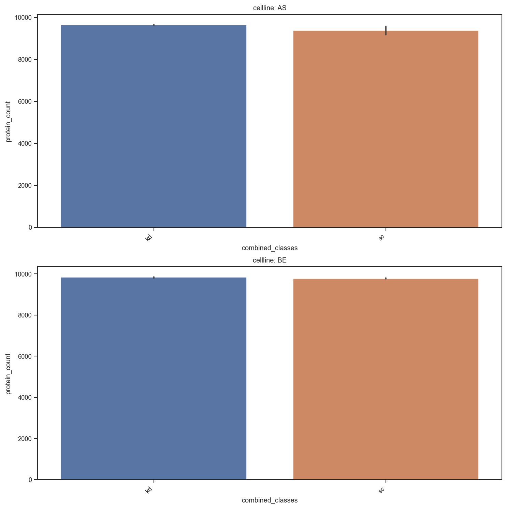

    Bar chart of sample-level metadata counts.

-   **[`plot_cv`](#plot-cv)**

    ---

    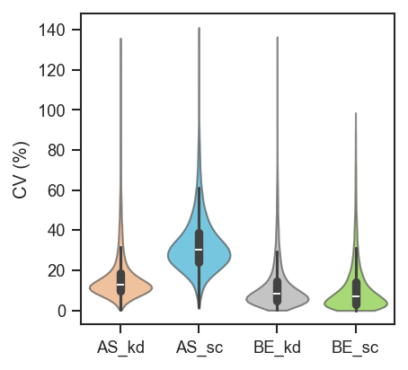

    Coefficient of variation distributions per group.

</div>

### `plot_summary` { #plot-summary }

[API reference ↗](../reference/plotting.md#src.scpviz.plotting.plot_summary)

```python
import matplotlib.pyplot as plt
from scpviz import plotting as scplt

fig, ax = plt.subplots(figsize=(5, 3))
scplt.plot_summary(ax, pdata, classes=["cellline", "condition"])
plt.show()
```

### `plot_cv` { #plot-cv }

[API reference ↗](../reference/plotting.md#src.scpviz.plotting.plot_cv)

Basic CV violins grouped by cell line and condition:

```python
import matplotlib.pyplot as plt
from scpviz import plotting as scplt

fig, ax = plt.subplots(figsize=(3, 3))
scplt.plot_cv(ax, pdata, classes=["cellline", "condition"])
plt.show()
```


Sample counts below each violin and median CV above the plot:

```python
fig, ax = plt.subplots(figsize=(3, 3))
scplt.plot_cv(
    ax, pdata, classes=["cellline", "condition"],
    show_n=True,
    annotate="median",
    annotate_kwargs={"fontsize": 7},
)
plt.show()
```

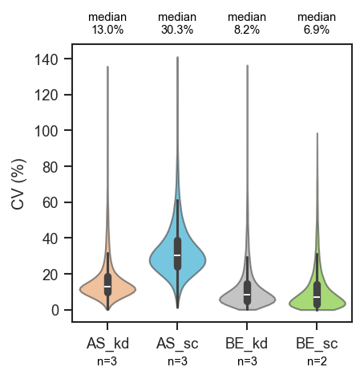

Custom per-group labels:

```python
fig, ax = plt.subplots(figsize=(3, 3))
scplt.plot_cv(
    ax, pdata, classes=["cellline", "condition"],
    annotate={"AS_kd": "replicate set A"},
)
plt.show()
```

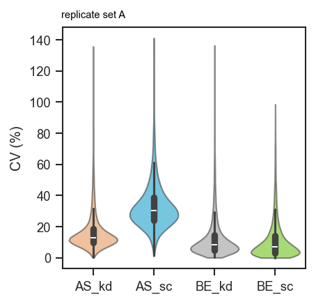

Export the underlying table (`CV` ratio and `CV_pct` percent columns):

```python
cv_df = scplt.plot_cv(None, pdata, classes=["cellline", "condition"], return_df=True)
```

---

## Abundance

### Overview { #abundance-overview }

<div class="grid cards" markdown>

-   **[`plot_abundance`](#abundance-code)**

    ---

    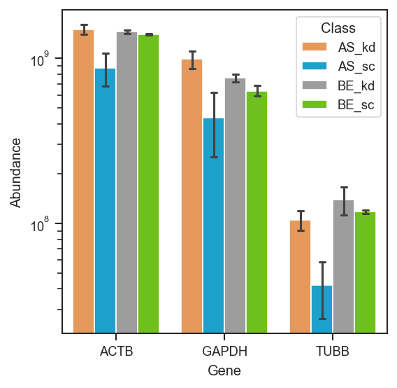

    Violin/bar plots for named proteins.

-   **[`plot_abundance_housekeeping`](#housekeeping-code)**

    ---

    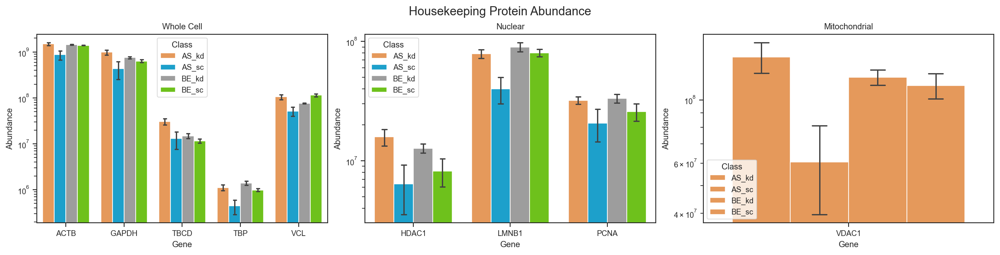

    Built-in housekeeping gene panel.

-   **[`plot_rankquant`](#rankquant-code)**

    ---

    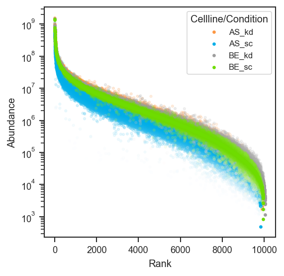

    Proteome-wide rank abundance scatter.

-   **[`plot_raincloud`](#raincloud-code)**

    ---

    

    Violin + box + strip combined distribution.

</div>

#### `plot_abundance_boxgrid` — plot type gallery { #abundance-boxgrid }

[`plot_abundance_boxgrid`](../reference/plotting.md#src.scpviz.plotting.plot_abundance_boxgrid) produces per-protein panels with consistent axes. Four `plot_type` options:

<div class="grid cards" markdown>

-   **box** — [↓ code](#boxgrid-box)

    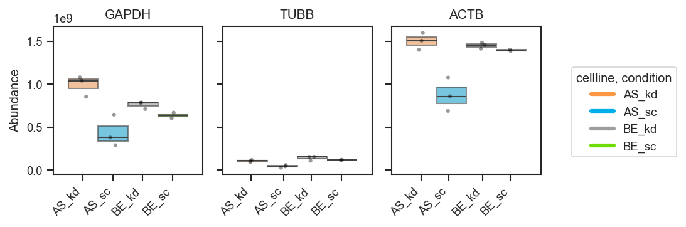

-   **bar** — [↓ code](#boxgrid-bar)

    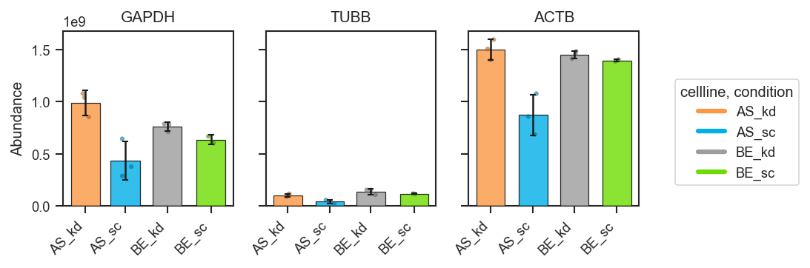

-   **line** — [↓ code](#boxgrid-line)

    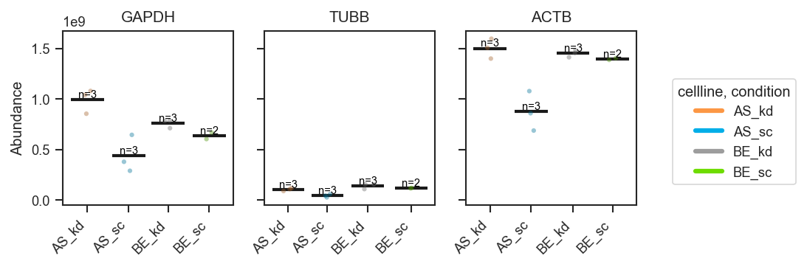

-   **violin** — [↓ code](#boxgrid-violin)

    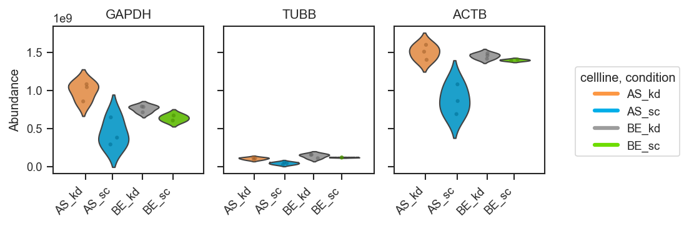

</div>

### `plot_abundance` { #abundance-code }

[API reference ↗](../reference/plotting.md#src.scpviz.plotting.plot_abundance)

```python
import matplotlib.pyplot as plt
from scpviz import plotting as scplt

fig, ax = plt.subplots(figsize=(4, 4))
scplt.plot_abundance(ax, pdata, namelist=["GAPDH", "TUBB", "ACTB"], classes=["cellline", "condition"])
plt.show()
```

### `plot_abundance_boxgrid` { #boxgrid-code }

[API reference ↗](../reference/plotting.md#src.scpviz.plotting.plot_abundance_boxgrid)

Called as a method on `pdata`; returns `(fig, axes)`.

#### Box { #boxgrid-box }

```python
fig, axes = pdata.plot_abundance_boxgrid(
    namelist=["GAPDH", "TUBB", "ACTB"],
    classes=["cellline", "condition"],
    plot_type="box",
    figsize=(2, 2.5),
)
plt.show()
```

#### Bar { #boxgrid-bar }

```python
fig, axes = pdata.plot_abundance_boxgrid(
    namelist=["GAPDH", "TUBB", "ACTB"],
    classes=["cellline", "condition"],
    plot_type="bar",
    bar_error="sd",
    figsize=(2, 2.5),
)
plt.show()
```

#### Line { #boxgrid-line }

```python
fig, axes = pdata.plot_abundance_boxgrid(
    namelist=["GAPDH", "TUBB", "ACTB"],
    classes=["cellline", "condition"],
    plot_type="line",
    show_n=True,
    figsize=(2, 2.5),
)
plt.show()
```

#### Violin { #boxgrid-violin }

```python
fig, axes = pdata.plot_abundance_boxgrid(
    namelist=["GAPDH", "TUBB", "ACTB"],
    classes=["cellline", "condition"],
    plot_type="violin",
    figsize=(2, 2.5),
)
plt.show()
```

#### Significance brackets { #boxgrid-significance }

Pass `sig_pairs` to run pairwise tests and draw significance bars (same group-spec format as `plot_volcano` / `de()`). Use `return_df=True` to also receive the abundance table and a `stats_df` of p-values.

**Per cell line** — compare sc vs kd within BE and within AS:

```python
fig, axes, df, stats = pdata.plot_abundance_boxgrid(
    namelist=["GAPDH", "TUBB", "ACTB"],
    classes=["cellline", "condition"],
    sig_pairs=[
        ({"cellline": "BE", "condition": "sc"}, {"cellline": "BE", "condition": "kd"}),
        ({"cellline": "AS", "condition": "sc"}, {"cellline": "AS", "condition": "kd"}),
    ],
    sig_kwargs={"fontsize": 8},
    return_df=True,
)
plt.show()
```

<figure markdown="span">
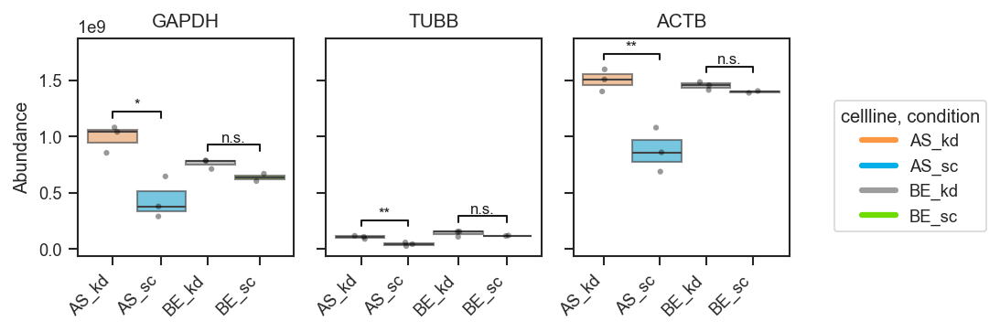
</figure>

**Shared group across pairs** — the same group can appear in multiple comparisons (brackets stack vertically):

```python
fig, axes = pdata.plot_abundance_boxgrid(
    namelist=["GAPDH", "TUBB", "ACTB"],
    classes=["cellline", "condition"],
    sig_pairs=[
        ({"cellline": "BE", "condition": "sc"}, {"cellline": "BE", "condition": "kd"}),
        ({"cellline": "BE", "condition": "kd"}, {"cellline": "AS", "condition": "kd"}),
    ],
    sig_kwargs={"fontsize": 8},
)
plt.show()
```

<figure markdown="span">
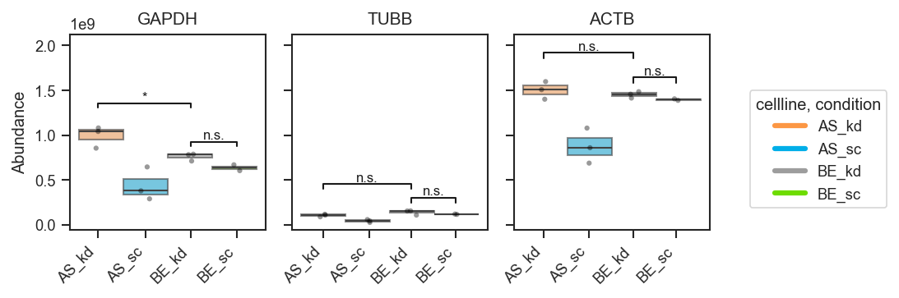
</figure>

**Two groups only** — when a single `classes` column has exactly two levels, use `sig_pairs=True`:

```python
fig, axes = pdata.plot_abundance_boxgrid(
    namelist=["GAPDH"],
    classes="treatment",
    sig_pairs=True,
)
plt.show()
```

`sig_kwargs` defaults include `sig_test` (`"ttest"`, `"mannwhitneyu"`, or `"wilcoxon"`) and `sig_equal_var`; remaining keys are passed to `plot_significance`. Groups with no detectable abundance are labeled ND and skipped for testing. See the API reference for [`plot_abundance_boxgrid`](../reference/plotting.md#src.scpviz.plotting.plot_abundance_boxgrid) and [`annotate_abundance_boxgrid_significance`](../reference/plotting.md#src.scpviz.plotting.annotate_abundance_boxgrid_significance).

### `plot_abundance_housekeeping` { #housekeeping-code }

[API reference ↗](../reference/plotting.md#src.scpviz.plotting.plot_abundance_housekeeping)

A quick normalization sanity check using the built-in housekeeping gene list.

```python
fig, ax = plt.subplots(figsize=(5, 4))
scplt.plot_abundance_housekeeping(ax, pdata, classes=["cellline", "condition"])
plt.show()
```

### `plot_rankquant` and `mark_rankquant` { #rankquant-code }

[`plot_rankquant` API ↗](../reference/plotting.md#src.scpviz.plotting.plot_rankquant) · [`mark_rankquant` API ↗](../reference/plotting.md#src.scpviz.plotting.mark_rankquant)

[`plot_rankquant`](#rankquant-code) ranks each protein by mean abundance and shows per-group scatter clouds — useful for comparing proteome coverage and dynamic range across conditions.

```python
import matplotlib.pyplot as plt
from scpviz import plotting as scplt

fig, ax = plt.subplots(figsize=(4, 4))
scplt.plot_rankquant(ax, pdata, classes=["cellline", "condition"])
plt.show()
```

Works the same on single-cell protein data after `directlfq` (use whichever `.obs` column you use for UMAP, e.g. `region`):

```python
fig, ax = plt.subplots(figsize=(4, 4))
scplt.plot_rankquant(ax, pdata_sc, classes=["region"])
plt.show()
```

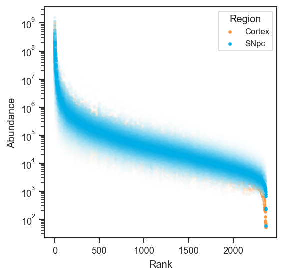

[`mark_rankquant`](../reference/plotting.md#src.scpviz.plotting.mark_rankquant) overlays specific proteins. `mark_df` requires an `accession` column and optionally `gene_primary`:

```python
import pandas as pd
from scpviz import utils as scu

classes_2 = ["cellline", "condition"]
class_list = scu.get_classlist(pdata.prot, classes_2)

acc = list(pdata.prot.var_names[:3])
mark_df = pd.DataFrame({"accession": acc})
if "Genes" in pdata.prot.var.columns:
    mark_df["gene_primary"] = pdata.prot.var.loc[acc, "Genes"].astype(str).values

fig, ax = plt.subplots(figsize=(4, 4))
scplt.plot_rankquant(ax, pdata, classes=classes_2)
scplt.mark_rankquant(
    ax, pdata, mark_df=mark_df,
    class_values=class_list[:4],
    color="black", label_type="gene",
)
plt.show()
```

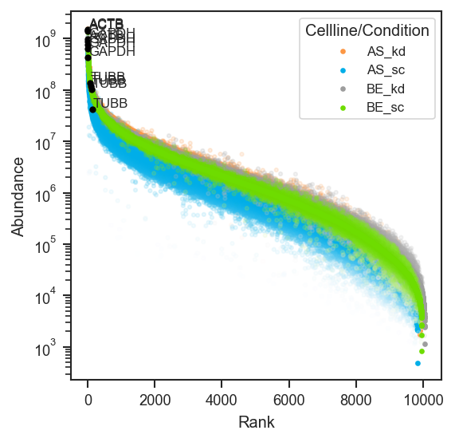

You can also build `mark_df` from a set-intersection query — see [Set operations](#upset-code).

### `plot_raincloud` and `mark_raincloud` { #raincloud-code }

[`plot_raincloud` API ↗](../reference/plotting.md#src.scpviz.plotting.plot_raincloud) · [`mark_raincloud` API ↗](../reference/plotting.md#src.scpviz.plotting.mark_raincloud)

[`plot_raincloud`](#raincloud-code) combines violin, box, and strip in one panel. Pass one color per combined class (the default `color=['blue']` is too short when `classes` has more than one column):

```python
import matplotlib.cm as cm
from scpviz import utils as scu

classes_2 = ["cellline", "condition"]
rain_colors = [cm.tab10(i % 10) for i in range(len(scu.get_classlist(pdata.prot, classes_2)))]

fig, ax = plt.subplots(figsize=(5, 4))
scplt.plot_raincloud(ax, pdata, classes=classes_2, color=rain_colors)
plt.show()
```

Single-cell version (same pattern; align `classes` with your UMAP coloring):

```python
classes_sc = ["region"]
rain_colors = [cm.tab10(i % 10) for i in range(len(scu.get_classlist(pdata_sc.prot, classes_sc)))]

fig, ax = plt.subplots(figsize=(5, 4))
scplt.plot_raincloud(ax, pdata_sc, classes=classes_sc, color=rain_colors)
plt.show()
```

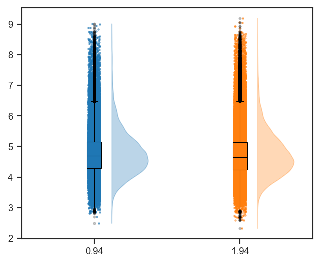

[`mark_raincloud`](#raincloud-code) accepts the same `mark_df` format as `mark_rankquant`:

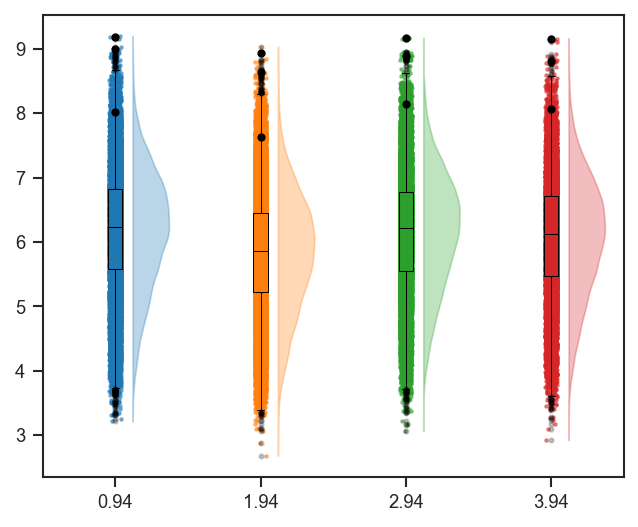

---

## Dimension reduction

### Overview { #dimreduc-overview }

<div class="grid cards" markdown>

-   **[`plot_pca`](#pca-code)**

    ---

    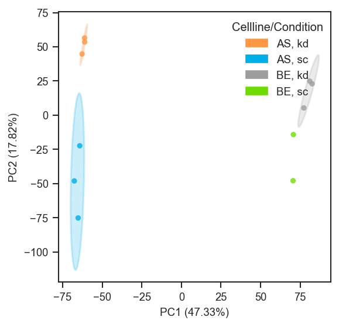

    PCA scatter with optional ellipses.

-   **[`plot_umap`](#umap-code)**

    ---

    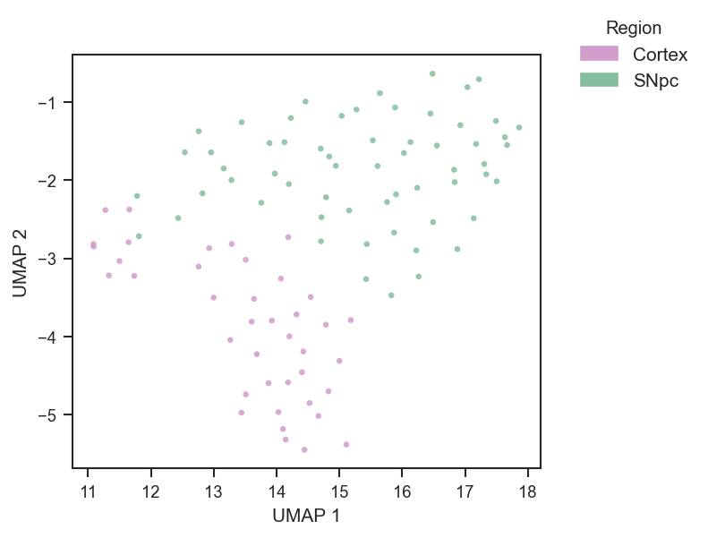

    UMAP projection for single-cell data.

-   **[`plot_pca_scree`](#scree-code)**

    ---

    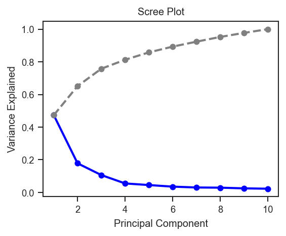

    Variance explained per PC.

-   **[`plot_pca_protein_vectors`](#pca-code)**

    ---

    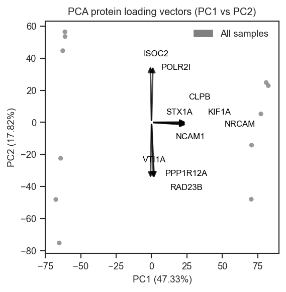

    Top protein loadings overlaid on PCA.

</div>

### `plot_pca` { #pca-code }

[`plot_pca` API ↗](../reference/plotting.md#src.scpviz.plotting.plot_pca) · [`plot_pca_protein_vectors` API ↗](../reference/plotting.md#src.scpviz.plotting.plot_pca_protein_vectors)

[`plot_pca`](#pca-code) runs PCA (or reuses cached results) and renders a scatter. Supports categorical and continuous coloring, edge colors, marker shapes, 3D projections, confidence ellipses, and tuple-key mapping.

```python
import matplotlib.pyplot as plt
from scpviz import plotting as scplt

fig, ax = plt.subplots(figsize=(4, 4))
pdata_norm.pca(on="protein")
scplt.plot_pca(ax, pdata_norm, classes=["cellline", "condition"], add_ellipses=True)
plt.show()
```

On single-cell data after `directlfq`:

```python
fig, ax = plt.subplots(figsize=(4, 4))
pdata_sc.pca(on="protein")
scplt.plot_pca(
    ax, pdata_sc,
    color=["region"],
    cmap={"Cortex": "#D19DCB", "SNpc": "#85BE9E"},
    add_ellipses=True,
)
plt.show()
```

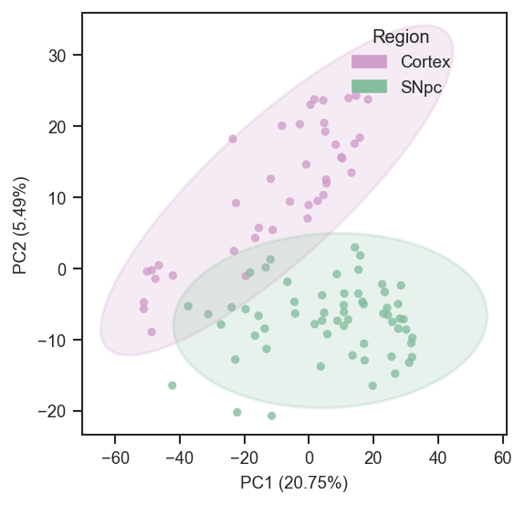

#### Abundance coloring (`colorbar_norm`, `nan_color`) { #abundance-coloring }

Pass a gene or protein name to `color=` for continuous face coloring; a colorbar is added automatically. Cells with zero, NaN, or negative abundances are drawn in `nan_color` (default `lightgrey`) beneath the colormap-mapped points.

`colorbar_norm` controls the scale on strictly positive abundances: `None` or `"linear"` uses auto limits; `"log10"` / `"log2"` apply log normalization with colorbar ticks at powers of 10 or 2; pass a `matplotlib.colors.Normalize` subclass (e.g. `LogNorm(vmin=, vmax=)`) for explicit limits. Override the colorbar title with `colorbar_label`.

=== "Linear scale"

    ```python
    fig, ax = plt.subplots(figsize=(4, 4))
    pdata_norm.pca(on="protein")
    scplt.plot_pca(
        ax, pdata_norm,
        color="GAPDH",
        cmap="plasma",
        nan_color="grey",
    )
    plt.show()
    ```

    <figure markdown="span">
    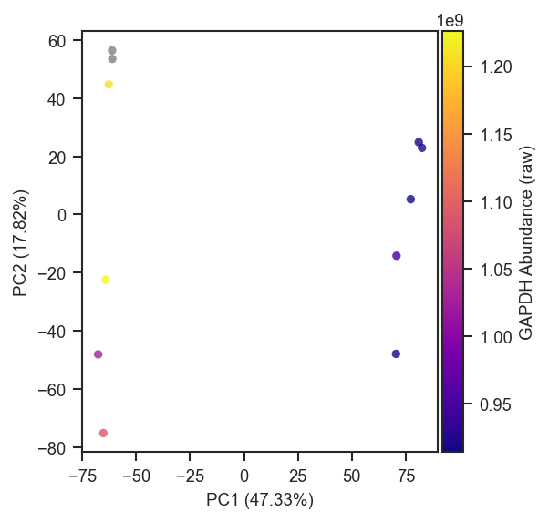
    </figure>

=== "Log10 scale"

    ```python
    fig, ax = plt.subplots(figsize=(4, 4))
    scplt.plot_pca(
        ax, pdata_norm,
        color="GAPDH",
        cmap="plasma",
        colorbar_norm="log10",
        nan_color="grey",
    )
    plt.show()
    ```

    <figure markdown="span">
    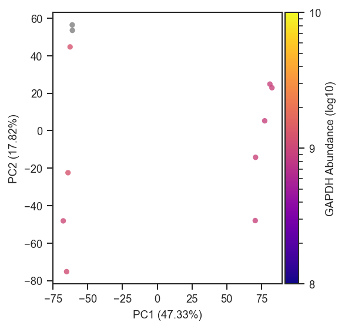
    </figure>

For sparse single-cell data, an explicit `LogNorm` can stabilize the colorbar (i.e. manually set limits of the colorbar):

```python
import matplotlib.colors as mcolors

scplt.plot_pca(
    ax, pdata_sc,
    color="GAPDH",
    cmap="plasma",
    colorbar_norm=mcolors.LogNorm(vmin=1, vmax=1e7),
    nan_color="black",
)
```

The same parameters apply to [`plot_umap`](#umap-code).

#### Tuple-key mapping

For studies with crossed metadata columns, `plot_pca` (and `plot_umap`) accept a `mapping` dict keyed by metadata combinations. Multi-column keys are tuples; a single column may use string keys. This assigns colors, edge colors, and marker shapes without pre-encoding a combined column:

=== "Literal face + edge colors (bulk)"

    ```python
    mapping_keys = ["cellline", "condition"]
    mapping = {
        ("AS", "kd"): {"color": "white", "edge_color": "black"},
        ("AS", "sc"): {"color": "white", "edge_color": "steelblue"},
        ("BE", "kd"): {"color": "lightgrey", "edge_color": "black"},
        ("BE", "sc"): {"color": "lightgrey", "edge_color": "steelblue"},
    }

    fig, ax = plt.subplots(figsize=(4, 4))
    scplt.plot_pca(ax, pdata_norm, mapping_keys=mapping_keys, mapping=mapping, force=True)
    scplt.shift_legend(ax)
    plt.show()
    ```

    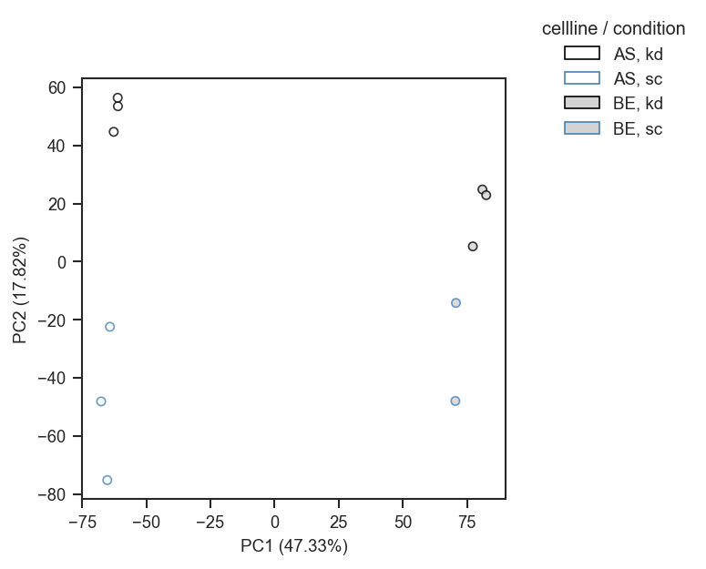

=== "Abundance face + mapped edges (single-cell)"

    ```python
    mapping_keys = ["region"]
    mapping = {
        "Cortex": {"edge_color": "#D19DCB"},
        "SNpc": {"edge_color": "#85BE9E"},
    }

    fig, ax = plt.subplots(figsize=(4, 4))
    scplt.plot_pca(
        ax, pdata_sc, color="Gapdh", cmap="plasma",
        mapping_keys=mapping_keys, mapping=mapping, force=True,
    )
    scplt.shift_legend(ax)
    plt.show()
    ```

    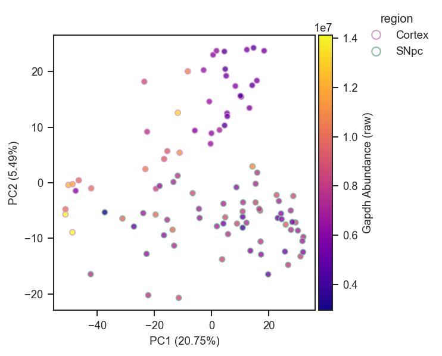

Combinations missing from `mapping` default to grey face with no edge. Pass `mapping_on_missing="raise"` to require all combinations to be present.

#### Sequential overlay (3D PCA)

Reuse one embedding and layer subsets with `subset_mask` (order matters). Example for `HCT116` treatment/time overlays:

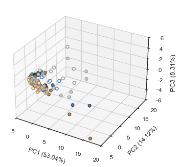

#### PCA Protein Vectors

[`plot_pca_protein_vectors`](#pca-code) overlays the top protein loadings as arrows:

```python
fig, ax = plt.subplots(figsize=(4, 4))
pdata_norm.pca(on="protein")
scplt.plot_pca_protein_vectors(ax, pdata_norm, n_vectors=10)
plt.show()
```

#### PCA-GSEA enrichment

We can also perform GSEA on the protein loadings per PC and visualize them in pathway vectors, bubble or heatmap style.
[`plot_pca_gsea_pathway_vectors`](../reference/plotting.md#src.scpviz.plotting.plot_pca_gsea_pathway_vectors), [`plot_pca_gsea_bubble`](../reference/plotting.md#src.scpviz.plotting.plot_pca_gsea_bubble), and [`plot_pca_gsea_heatmap`](../reference/plotting.md#src.scpviz.plotting.plot_pca_gsea_heatmap) overlay GSEA pathway results on PCA space — these functions automatically run `pdata.pca_gsea()` and plot using that data.

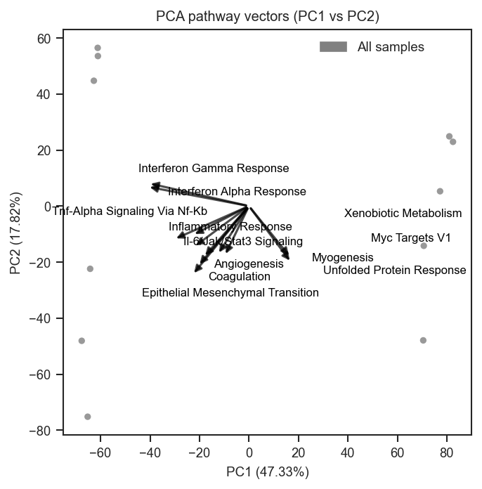

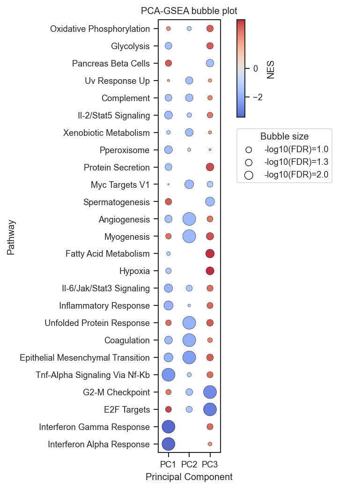

```python
fig, ax = plt.subplots(figsize=(6, 8))
scplt.plot_pca_gsea_bubble(ax, pdata_norm, pcs=[1, 2, 3], top_n=25)
plt.show()
```

Optional size controls: `size_scale` sets max bubble diameter as a fraction of cell pitch (default `0.85`); `size_fdr_cap` clips `-log10(FDR)` used for sizing (default `5.0`). Use `pc_pad` to widen/narrow gaps between PC columns (half-spacing; default `0.6`). `cbar_scale` multiplies NES colorbar height (`1` = default; `<1` shorter, `>1` taller); the size legend stays stacked under it.

```python
fig, ax = plt.subplots(figsize=(6, 8))
scplt.plot_pca_gsea_bubble(
    ax,
    pdata_norm,
    pcs=[1, 2, 3],
    top_n=25,
    size_scale=0.5,   # tighter bubbles
    size_fdr_cap=10,  # more extreme FDR contrast
    pc_pad=0.75,      # wider gaps between PC columns
    cbar_scale=1.5,   # taller NES colorbar
)
plt.show()
```

Colorbar height comparison (`cbar_scale` = 0.5 / 1 / 1.5):

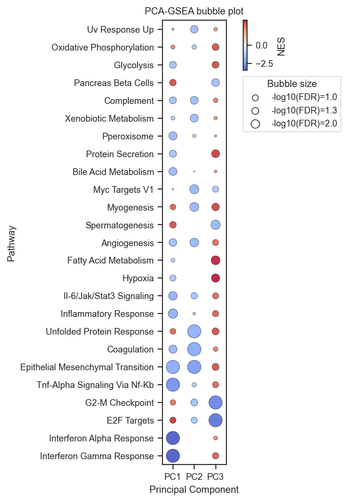

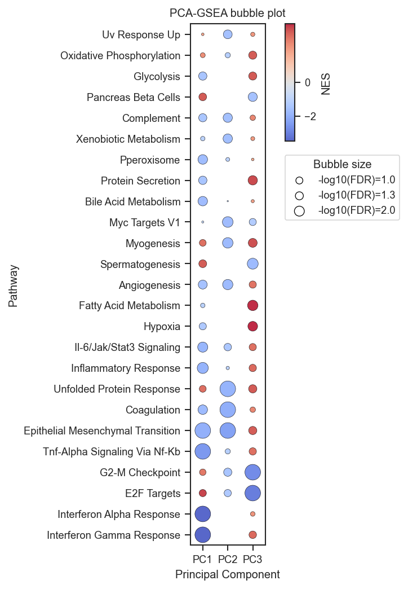

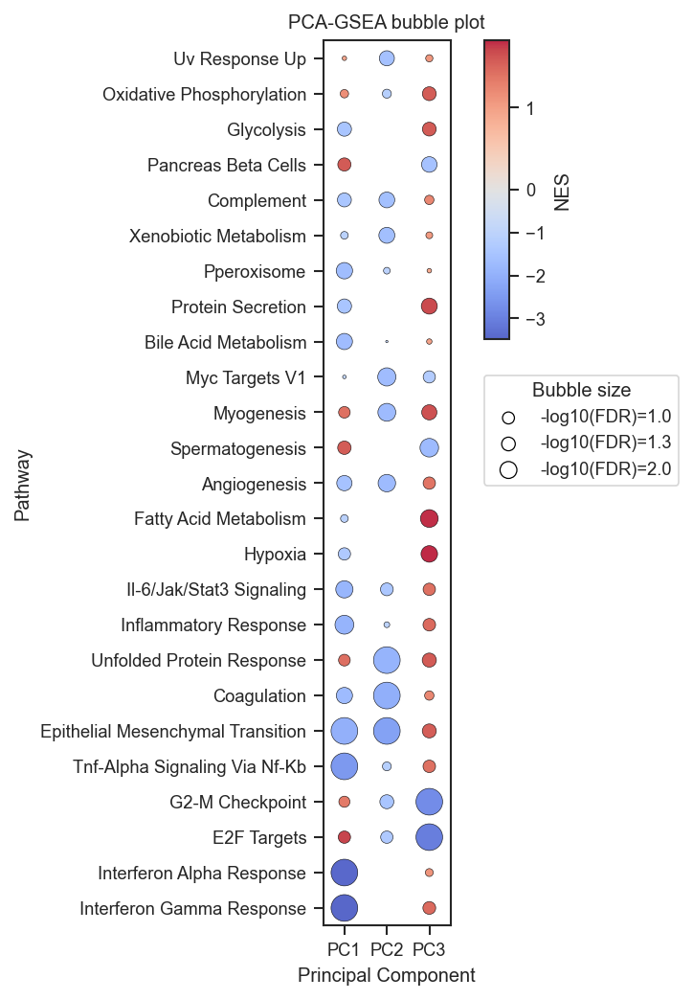

We can also plot similarly using a heatmap.

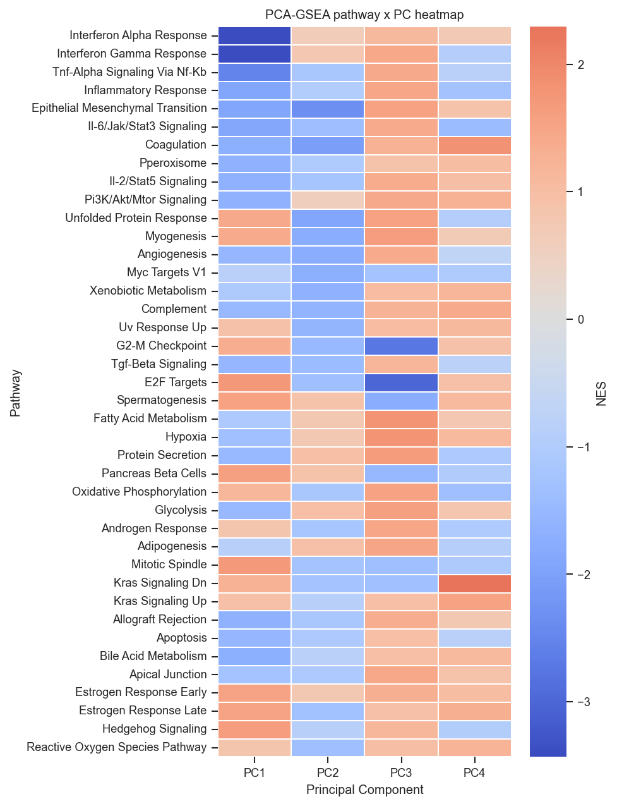

### `plot_pca_scree` { #scree-code }

[API reference ↗](../reference/plotting.md#src.scpviz.plotting.plot_pca_scree)

```python
fig, ax = plt.subplots(figsize=(4, 3))
scplt.plot_pca_scree(ax, pdata_norm.prot.uns["pca"])
plt.show()
```

### `plot_umap` { #umap-code }

[API reference ↗](../reference/plotting.md#src.scpviz.plotting.plot_umap)

[`plot_umap`](#umap-code) mirrors the `plot_pca` interface. Pass `force=True` on first call or after changing normalization.

```python
import matplotlib.pyplot as plt
from scpviz import plotting as scplt

fig, ax = plt.subplots(figsize=(4.5, 4))
pdata_sc.pca(on="protein")
scplt.plot_umap(
    ax, pdata_sc,
    color=["region"],
    cmap={"Cortex": "#D19DCB", "SNpc": "#85BE9E"},
    force=True,
    umap_params={"min_dist": 0.3, "n_neighbors": 30, "random_state": 42},
    s=10, alpha=0.85,
)
scplt.shift_legend(ax)
plt.show()
```

[`plot_umap`](#umap-code) accepts the same abundance-coloring options as PCA — see [Abundance coloring](#abundance-coloring). On single-cell data after `directlfq` (mouse gene ``Gapdh``):

```python
fig, ax = plt.subplots(figsize=(4.5, 4))
pdata_sc.pca(on="protein")
scplt.plot_umap(
    ax, pdata_sc,
    color="Gapdh",
    cmap="plasma",
    colorbar_norm="log10",
    nan_color="grey",
    force=True,
    umap_params={"min_dist": 0.3, "n_neighbors": 30, "random_state": 42},
    s=10, alpha=0.85,
)
plt.show()
```

<figure markdown="span">
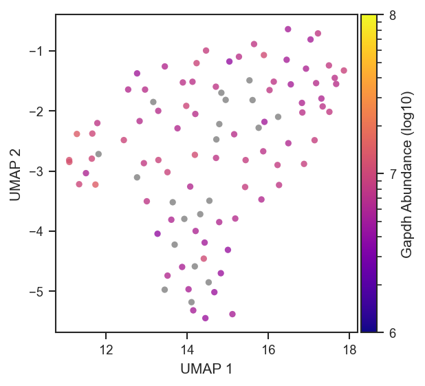
</figure>

---

## Correlation and clustering

### Overview { #corr-overview }

<div class="grid cards" markdown>

-   **[`plot_pairwise_correlation`](#pairwise-code)**

    ---

    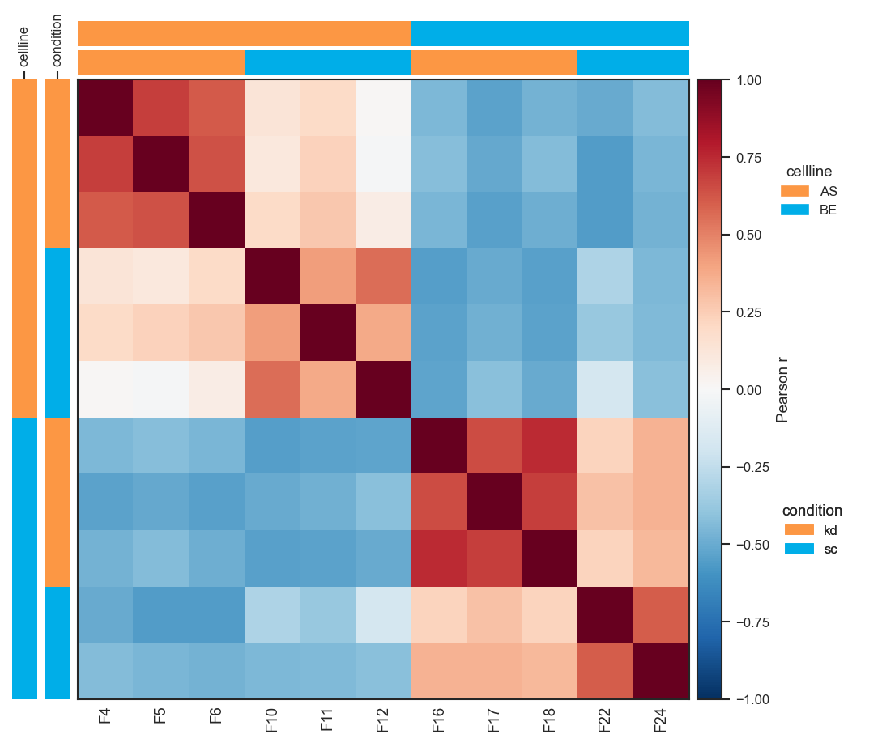

    Sample × sample Pearson/Spearman heatmap.

-   **[`plot_grouped_heatmap`](#grouped-heatmap-code)**

    ---

    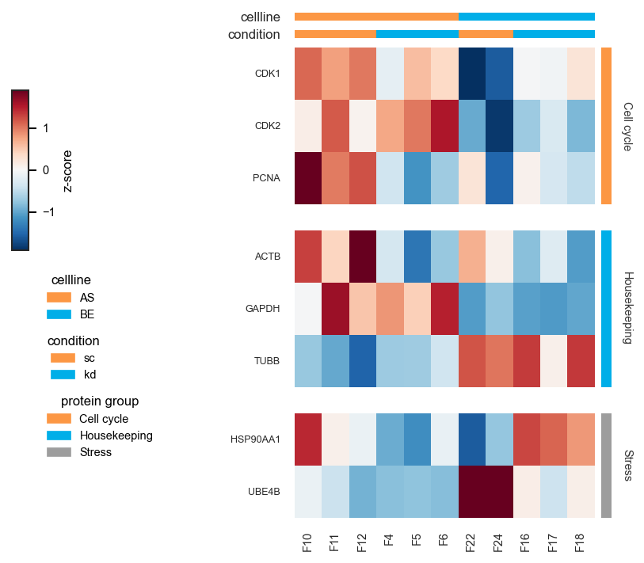

    Curated protein-group blocks × samples with header strips.

-   **[`plot_clustered_heatmap`](#clustered-heatmap-code)**

    ---

    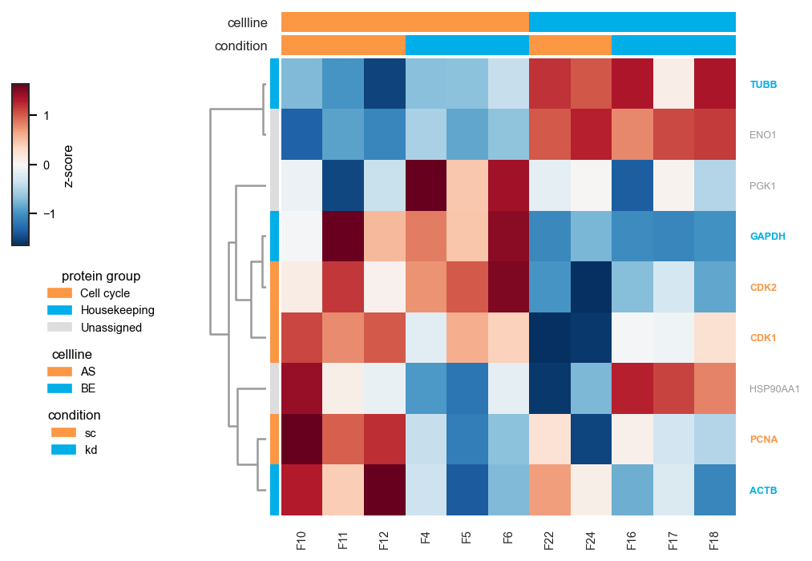

    Hierarchically clustered proteins × samples with optional group strip.

-   **[`plot_clustermap`](#clustermap-code)**

    ---

    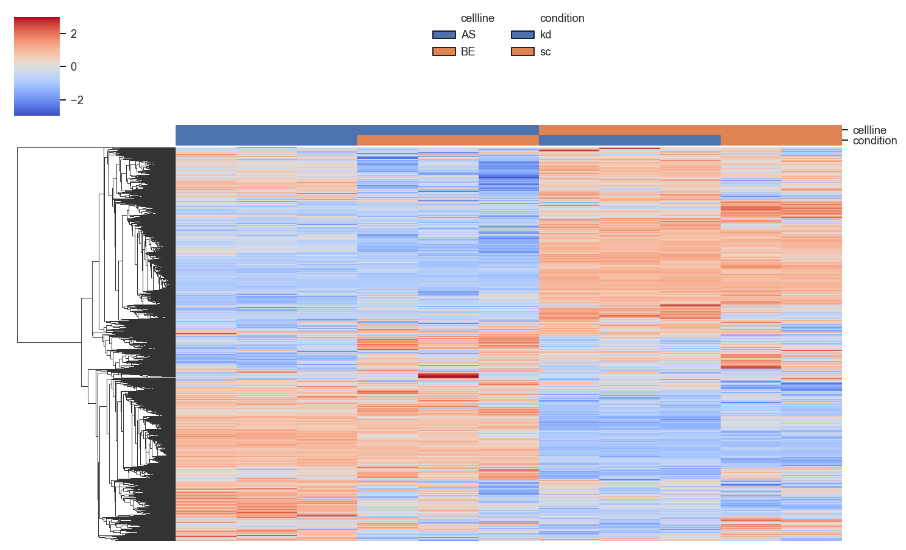

    Legacy seaborn clustered heatmap with annotation bars.

</div>

### `plot_pairwise_correlation` { #pairwise-code }

[API reference ↗](../reference/plotting.md#src.scpviz.plotting.plot_pairwise_correlation)

[`plot_pairwise_correlation`](#pairwise-code) generates a sample × sample (or group × group) correlation heatmap. Computing a per-protein z-score layer first produces more interpretable results:

```python
import matplotlib.pyplot as plt
import numpy as np
from scpviz import plotting as scplt
from scpviz import utils as scu

adata = scu.get_adata(pdata_norm, "protein")
X = np.asarray(scu.get_adata_layer(adata, "X"), dtype=float)
mu = np.nanmean(X, axis=0, keepdims=True)
sig = np.nanstd(X, axis=0, keepdims=True)
sig = np.where(np.isfinite(sig) & (sig > 0), sig, 1.0)
adata.layers["X_pw_zscore"] = (X - mu) / sig

fig, ax = scplt.plot_pairwise_correlation(
    pdata_norm,
    classes=["cellline", "condition"],
    method="pearson",
    show_samples=True,
    layer="X_pw_zscore",
    force=True,
)
plt.show()
```

Same approach on single-cell data (align `classes` with your UMAP coloring):

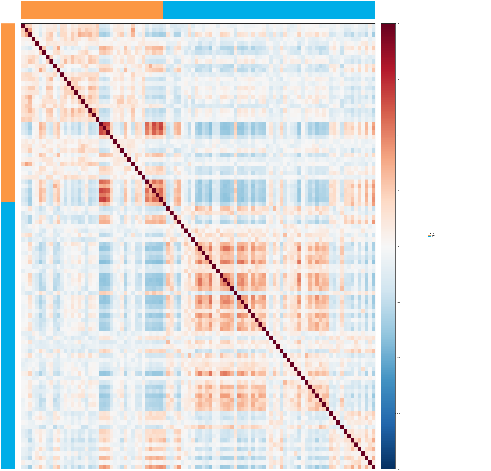

### `plot_grouped_heatmap` { #grouped-heatmap-code }

[API reference ↗](../reference/plotting.md#src.scpviz.plotting.plot_grouped_heatmap)

[`plot_grouped_heatmap`](#grouped-heatmap-code) draws curated protein groups as spatial blocks (with optional gaps), sample header strips from `classes`, and a right-hand group colour bar. Proteins missing from the object still keep a grey row so block sizes stay stable.

Horizontal white gaps between sample leaf blocks (same full `classes` combination) default on via `column_spacing=True` (half a content cell). Vertical gaps between protein groups use the same scale via `row_spacing=True`. Use `False`/`0` for none, or a float to scale that default (`0.5` = half, `2` = double). Header-to-heatmap space is `header_spacing` (default `0.06`).

```python
from scpviz import plotting as scplt

fig = scplt.plot_grouped_heatmap(
    pdata_norm,
    protein_groups={
        "Cell cycle": ["CDK1", "CDK2", "PCNA"],
        "Housekeeping": ["GAPDH", "TUBB", "ACTB"],
        "Stress": ["HSP90AA1", "UBE4B"],
    },
    classes=["cellline", "condition"],
    sort_by={"cellline": ["AS", "BE"], "condition": ["sc", "kd"]},
    layer="X",
    figsize=(7, 5),
    text_size=8,
)
```


Row / column / header spacing (`row_spacing`, `column_spacing`, `header_spacing`):

```python
fig = scplt.plot_grouped_heatmap(
    pdata_norm,
    protein_groups={
        "Cell cycle": ["CDK1", "CDK2", "PCNA"],
        "Housekeeping": ["GAPDH", "TUBB", "ACTB"],
        "Stress": ["HSP90AA1", "UBE4B"],
    },
    classes=["cellline", "condition"],
    sort_by={"cellline": ["AS", "BE"], "condition": ["sc", "kd"]},
    row_spacing=0.75,
    column_spacing=0.5,
    header_spacing=0.08,
)
```


Header colours are one strip per class (not one colour per class combination). With a single class you can pass a flat map; with multiple classes nest by class name:

```python
# Single class
header_colors = {"sc": "#55A868", "kd": "#C44E52"}

# Multiple classes
header_colors = {
    "cellline": {"AS": "#4C72B0", "BE": "#DD8452"},
    "condition": {"sc": "#55A868", "kd": "#C44E52"},
}
```

### `plot_clustered_heatmap` { #clustered-heatmap-code }

[API reference ↗](../reference/plotting.md#src.scpviz.plotting.plot_clustered_heatmap)

[`plot_clustered_heatmap`](#clustered-heatmap-code) hierarchically clusters protein rows. Provide exactly one of `proteins=` (explicit list) or `stats_key=` (DE / volcano table in `pdata.stats`). Optional `protein_groups` annotate rows with a colour strip (not spatial blocks). Same `column_spacing` / `header_spacing` semantics as the grouped heatmap.

```python
from scpviz import plotting as scplt

fig = scplt.plot_clustered_heatmap(
    pdata_norm,
    classes=["cellline", "condition"],
    proteins=[
        "CDK1", "CDK2", "PCNA",
        "GAPDH", "TUBB", "ACTB",
        "HSP90AA1", "ENO1", "PGK1",
    ],
    protein_groups={
        "Cell cycle": ["CDK1", "CDK2", "PCNA"],
        "Housekeeping": ["GAPDH", "TUBB", "ACTB"],
    },
    sort_by={"cellline": ["AS", "BE"], "condition": ["sc", "kd"]},
    show_unassigned=True,
    figsize=(7, 5),
    text_size=8,
)
```


Column / header spacing:

```python
fig = scplt.plot_clustered_heatmap(
    pdata_norm,
    classes=["cellline", "condition"],
    proteins=[
        "CDK1", "CDK2", "PCNA",
        "GAPDH", "TUBB", "ACTB",
        "HSP90AA1", "ENO1", "PGK1",
    ],
    protein_groups={
        "Cell cycle": ["CDK1", "CDK2", "PCNA"],
        "Housekeeping": ["GAPDH", "TUBB", "ACTB"],
    },
    sort_by={"cellline": ["AS", "BE"], "condition": ["sc", "kd"]},
    column_spacing=0.5,
    header_spacing=0.08,
    show_unassigned=True,
)
```

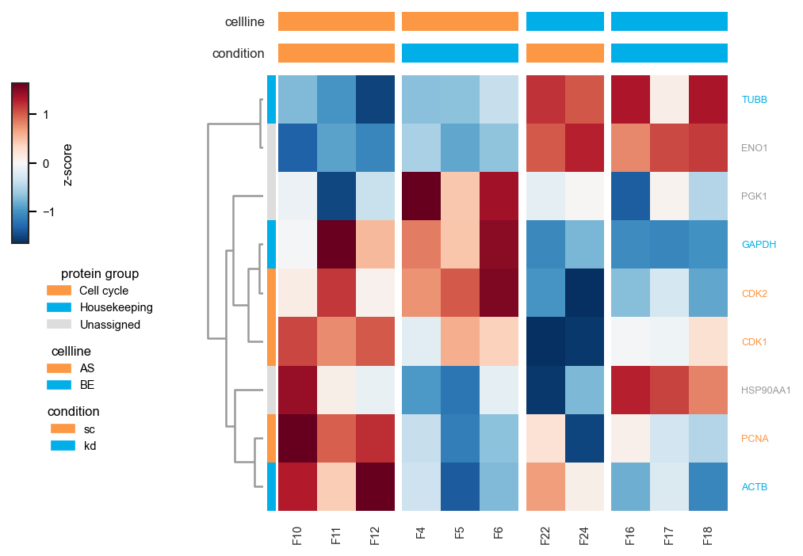

After `plot_volcano` / `de`, cluster significant hits. For a readable figure, keep a top-N subset (same approach as `docs/generate_plot_figures.py`):

```python
import matplotlib.pyplot as plt
from scpviz import plotting as scplt

values = [
    {"cellline": "BE", "condition": "kd"},
    {"cellline": "BE", "condition": "sc"},
]

fig, ax = plt.subplots(figsize=(4, 4))
ax, volcano_df = scplt.plot_volcano(
    ax, pdata_norm, values=values, return_df=True
)

# Prefer the stats key written by volcano/de when present
de_key = None
de_df = volcano_df
for k, v in (getattr(pdata_norm, "stats", {}) or {}).items():
    if (
        hasattr(v, "columns")
        and "significance" in v.columns
        and "significance_score" in v.columns
    ):
        de_key = k
        de_df = v
        break
if de_key is None:
    de_key = "volcano_de"
    pdata_norm.stats[de_key] = de_df

hits = de_df[de_df["significance"].isin(["upregulated", "downregulated"])]
top40 = (
    hits.assign(_s=hits["significance_score"].abs())
    .sort_values("_s", ascending=False)
    .head(40)
)
slim_key = f"{de_key} (top 40)"
pdata_norm.stats[slim_key] = top40

fig = scplt.plot_clustered_heatmap(
    pdata_norm,
    classes=["cellline", "condition"],
    stats_key=slim_key,
    sort_by={"cellline": ["AS", "BE"], "condition": ["sc", "kd"]},
    figsize=(7, 6),
    text_size=7,
)
```

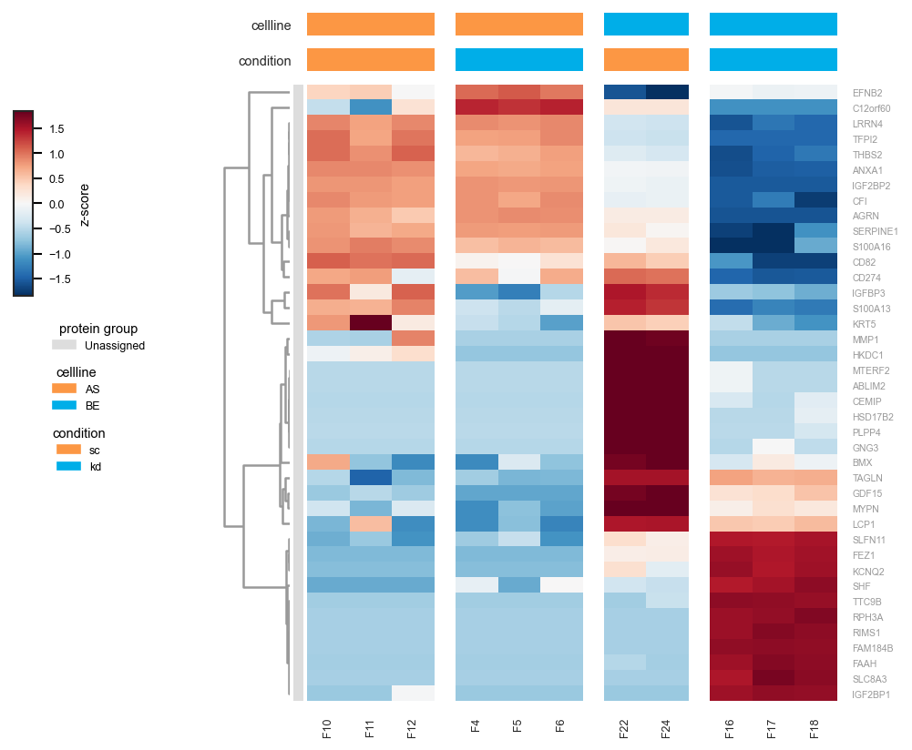

### `plot_clustermap` { #clustermap-code }

[API reference ↗](../reference/plotting.md#src.scpviz.plotting.plot_clustermap)

[`plot_clustermap`](#clustermap-code) returns a seaborn `ClusterGrid` object (`g`), not a figure — call `g.savefig(...)` if saving. Prefer [`plot_clustered_heatmap`](#clustered-heatmap-code) for new publication figures.

```python
import matplotlib.pyplot as plt
from scpviz import plotting as scplt

fig, ax = plt.subplots(figsize=(1, 1))
g = scplt.plot_clustermap(
    ax, pdata_norm, on="prot",
    classes=["cellline", "condition"],
    force=True, impute="row_min",
    z_score=0, center=0,
    linewidth=0, figsize=(10, 6),
)
plt.show()
```

Custom annotation colors via a LUT dict:

```python
import seaborn as sns

lut = {
    "cellline": {"AS": "#e41a1c", "BE": "#377eb8"},
    "condition": {"kd": "#4daf4a", "sc": "#984ea3"},
}
scplt.plot_clustermap(ax, pdata, classes=["cellline", "condition"], lut=lut, force=True)
```

---

## Volcano plots

### Overview { #volcano-overview }

<div class="grid cards" markdown>

-   **[`plot_volcano`](#volcano-code)**

    ---

    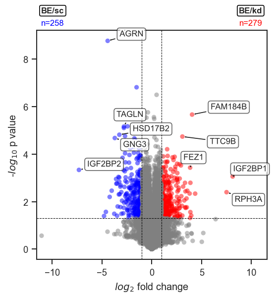

    Volcano plot from a pAnnData comparison.

-   **[`mark_volcano_by_significance`](#volcano-mark)**

    ---

    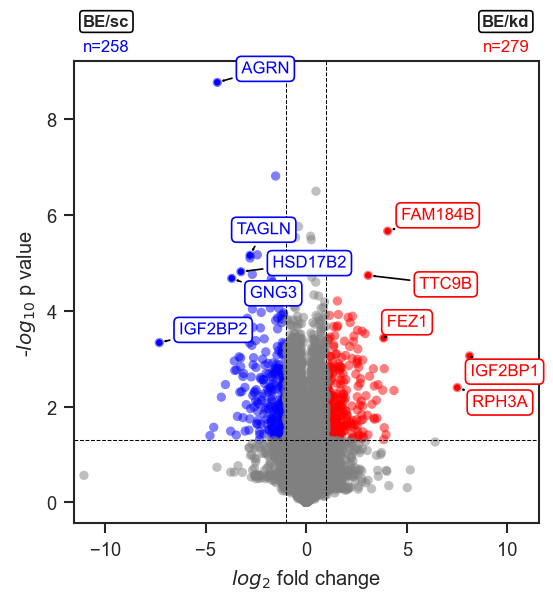

    Color-coded highlights by DE direction.

-   **[`mark_volcano`](#volcano-mark)**

    ---

    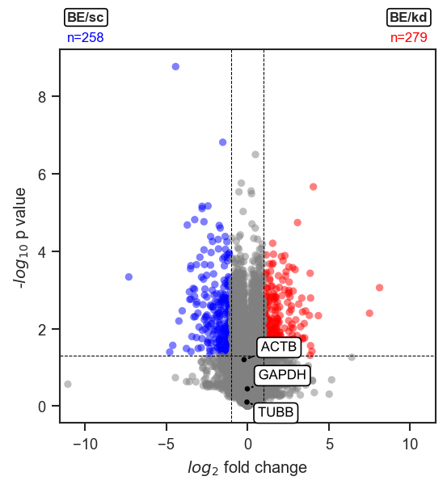

    Highlight a fixed list in a single color.

-   **[`volcano_adjust_and_outline_texts`](#volcano-mark)**

    ---

    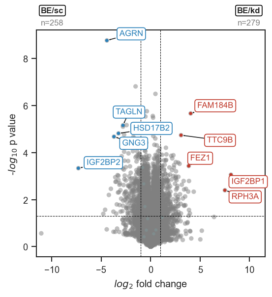

    De-overlap text labels after marking.

</div>

### `plot_volcano` { #volcano-code }

[API reference ↗](../reference/plotting.md#src.scpviz.plotting.plot_volcano)

Groups are specified as a list of metadata dicts. The function runs DE internally and returns `volcano_df` when `return_df=True`:

```python
import matplotlib.pyplot as plt
from scpviz import plotting as scplt

values = [
    {"cellline": "BE", "condition": "kd"},
    {"cellline": "BE", "condition": "sc"},
]

fig, ax = plt.subplots(figsize=(4, 4))
ax, volcano_df = scplt.plot_volcano(ax, pdata_norm, values=values, return_df=True)
plt.show()
```

### Highlighting proteins { #volcano-mark }

[`mark_volcano` API ↗](../reference/plotting.md#src.scpviz.plotting.mark_volcano) · [`mark_volcano_by_significance` API ↗](../reference/plotting.md#src.scpviz.plotting.mark_volcano_by_significance) · [`volcano_adjust_and_outline_texts` API ↗](../reference/plotting.md#src.scpviz.plotting.volcano_adjust_and_outline_texts)

Set `no_marks=True` to render all points grey, then layer highlights with `mark_volcano_by_significance` (color by DE direction) and/or `mark_volcano` (single color). Collect all `texts` lists and call `volcano_adjust_and_outline_texts` once at the end:

```python
fig, ax = plt.subplots(figsize=(4, 4))
ax, volcano_df = scplt.plot_volcano(
    ax, pdata_norm, values=values, return_df=True, no_marks=True
)

color_dict = {
    "upregulated": "#E07B6A",
    "downregulated": "#6AB4E0",
    "not_significant": "#FFFFFF6A",
}

texts = []
ax, t = scplt.mark_volcano_by_significance(
    ax, volcano_df,
    label=["GAPDH", "TUBB", "ACTB", "VCP"],
    color=color_dict, return_texts=True,
)
texts.extend(t)

ax, t = scplt.mark_volcano(
    ax, volcano_df, label=["AHNAK"], label_color="orange", return_texts=True
)
texts.extend(t)

scplt.volcano_adjust_and_outline_texts(texts, expand=(1.5, 3))
plt.show()
```

### Customizing group annotations

```python
# Reposition up/down annotations
scplt.plot_volcano(
    ax, pdata_norm, values=values,
    group_annot_kwargs={"pos": {"group1_xy": (0.98, 1.10), "group2_xy": (0.02, 1.10)}},
    up_kwargs={"fontsize": 9},
    down_kwargs={"fontsize": 9},
)

# Remove bbox but keep text
scplt.plot_volcano(ax, pdata_norm, values=values, group_annot_kwargs={"bbox": None})

# Turn off all annotations
scplt.plot_volcano(ax, pdata_norm, values=values, group_annot=False)
```

[`add_volcano_legend`](../reference/plotting.md#src.scpviz.plotting.add_volcano_legend) adds standard up/down/not-significant legend handles to any axis:

```python
scplt.add_volcano_legend(ax)
```

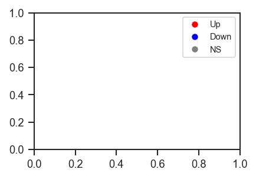

---

## Set operations

### Overview { #sets-overview }

<div class="grid cards" markdown>

-   **[`plot_venn`](#venn-code)**

    ---

    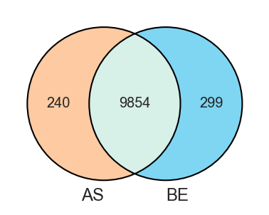

    Venn diagram for 2–3 sets.

-   **[`plot_upset`](#upset-code)**

    ---

    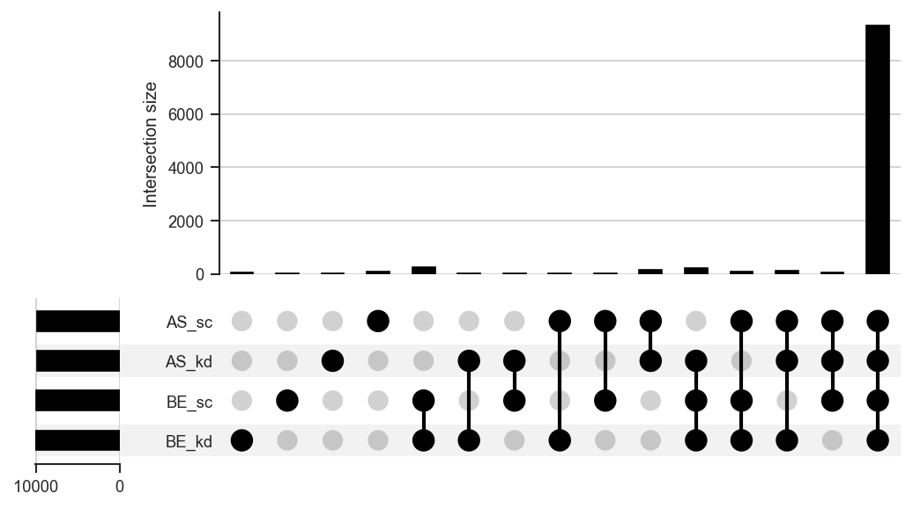

    UpSet diagram for any number of sets.

-   **`plot_upset` styled**

    ---

    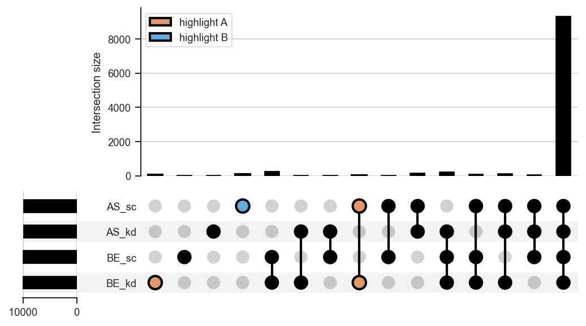

    Highlight specific intersections with `style_subsets`.

</div>

### `plot_venn` { #venn-code }

[API reference ↗](../reference/plotting.md#src.scpviz.plotting.plot_venn)

```python
import matplotlib.pyplot as plt
from scpviz import plotting as scplt

fig, ax = plt.subplots(figsize=(3, 3))
scplt.plot_venn(ax, pdata, classes="cellline")
plt.show()
```

### `plot_upset` { #upset-code }

[API reference ↗](../reference/plotting.md#src.scpviz.plotting.plot_upset)

```python
upplot = scplt.plot_upset(pdata, classes=["cellline", "condition"], show_counts=False)
upplot.plot()
plt.show()
```

**Highlighting intersections** with `style_subsets`: resolve category keys from `get_upset_contents` first, then style the intersections of interest:

```python
from scpviz import utils as scu

contents = scu.get_upset_contents(pdata, classes=["cellline", "condition"], upsetForm=False)
keys = list(contents.keys())  # e.g. ['BE_kd', 'BE_sc', 'AS_kd', 'AS_sc']

upplot = scplt.plot_upset(pdata, classes=["cellline", "condition"], show_counts=False)
upplot.style_subsets(
    present=["BE_kd"], absent=[k for k in keys if k != "BE_kd"],
    edgecolor="black", facecolor="#E59866", linewidth=2, label="BE+kd only",
)
upplot.style_subsets(
    present=["AS_sc"], absent=[k for k in keys if k != "AS_sc"],
    edgecolor="black", facecolor="#5DADE2", linewidth=2, label="AS+sc only",
)
upplot.plot()
plt.show()
```

`get_upset_query` converts any intersection into a `mark_df` for use with [`mark_rankquant`](#rankquant-code) or [`mark_raincloud`](#raincloud-code). Pass `fetch_uniprot` explicitly: use `False` for large sets (reads gene names from `pdata` only), or `True` to query UniProt for full metadata.

```python
upset_data = scu.get_upset_contents(pdata, classes=["cellline", "condition"])

# Large intersection — skip UniProt (fast; uses .var gene names when available)
mark_df = scu.get_upset_query(
    upset_data, present=["BE_kd"], absent=["AS_kd", "AS_sc", "BE_sc"],
    fetch_uniprot=False, pdata=pdata,
)

# Small intersection — fetch UniProt metadata (e.g. for gene labels)
mark_df = scu.get_upset_query(
    upset_data, present=["BE_kd"], absent=["AS_kd", "AS_sc", "BE_sc"],
    fetch_uniprot=True,
)
```

The same workflow applies after [`plot_venn`](#venn-code) when `return_contents=True`: build `upset_data` with `get_upset_contents(..., upsetForm=True)` for querying, while the dict from `upsetForm=False` is only needed to resolve set label names.

---

## Utility functions

**[`shift_legend`](../reference/plotting.md#src.scpviz.plotting.shift_legend)** repositions a legend outside the plot area without resizing the figure:

```python
scplt.shift_legend(ax)                                         # default: right of axes
scplt.shift_legend(ax, loc="upper left", bbox_to_anchor=(1, 1))
```

**[`plot_significance`](../reference/plotting.md#src.scpviz.plotting.plot_significance)** adds a significance bracket between two x-positions on any existing axis:

```python
fig, ax = plt.subplots(figsize=(2, 3))
ax.bar([0, 1], [10, 15])
scplt.plot_significance(ax, 16.0, 1.0, x1=0, x2=1, pval="*")
plt.show()
```

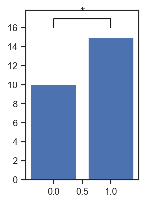

**[`get_color`](../reference/plotting.md#src.scpviz.plotting.get_color)** returns colors, colormaps, or palettes from the package defaults:

```python
colors = scplt.get_color("colors", n=4)   # list of 4 categorical colors
cmap   = scplt.get_color("cmap")          # default sequential colormap
scplt.get_color("show")                   # display the full palette
```