# Single-cell Proteomics Analysis Tutorial 
[](https://github.com/gnaprs/scpviz/raw/main/docs/tutorials/single_cell.ipynb)
[](https://colab.research.google.com/github/gnaprs/scpviz/blob/main/docs/tutorials/single_cell.ipynb)

!!! abstract "Tutorial overview"

    This tutorial demonstrates a typical analysis workflow for **single-cell proteomics data** using `scpviz`. Single-cell proteomic datasets are generally more sparse and contain higher levels of missing values than bulk proteomics, requiring careful preprocessing, normalization, and interpretation. Here we illustrate common steps including dataset filtering, handling missing values, normalization, dimensionality reduction, differential expression analysis, and integration with external single-cell tools such as **scanpy**.

    The workflow presented here reflects the authors' current approach in the rapidly developing field of single-cell proteomics. Several recent reviews discuss best practices and analytical considerations for these datasets, including those by Gatto et al. (2023), Vanderaa and Gatto (2023), and Wang et al. (2025). Because the field is evolving quickly, analytical approaches continue to develop and may vary depending on experimental design and data characteristics.

    **Recommended references**

    - [Gatto L. et al. (2023). *Initial recommendations for performing, benchmarking and reporting single-cell proteomics experiments.* Nature Methods.](https://www.nature.com/articles/s41592-023-01785-3)

    - [Vanderaa C. & Gatto L. (2023). *Revisiting the Thorny Issue of Missing Values in Single-Cell Proteomics.* Journal of Proteome Research.](https://doi.org/10.1021/acs.jproteome.3c00227)

    - [Wang S. et al. (2025). *Benchmarking informatics workflows for data-independent acquisition single-cell proteomics.* Nature Communications.](https://www.nature.com/articles/s41467-025-65174-4)

!!! info "Installation"
    This tutorial uses single-cell-specific features that require optional dependencies. Install them with:
    ```
    pip install "scpviz[sc]"
    ```

In this tutorial we use a small example dataset derived from our recent preprint ([Sayan and Pang et al. 2025](https://doi.org/10.1101/2025.02.10.637505)). The dataset contains **single-cell proteomic measurements of astrocytes**, comparing injured versus uninjured cells.

[](https://github.com/gnaprs/scpviz/raw/main/docs/assets/report_sc.parquet)

We begin by loading the dataset into a `pAnnData` object.

```py title="Import required modules"
from scpviz import pAnnData as pAnnData
from scpviz import plotting as scplt
from scpviz import utils as scutils
import scanpy as sc

obs_columns = ['date', 'acquisition', 'size', 'cell_type', 'replicate']

pdata_sc = pAnnData.import_data(
    source_type='diann',
    report_file='report_sc.parquet',
    obs_columns=obs_columns
)
```

The `.summary` table contains sample-level metadata and quality metrics such as protein counts, peptide counts, and intensity statistics. We can inspect the dataset by looking at the sample summary table:

```py title="Inspect pdata summary"
import pandas as pd
pd.DataFrame(pdata_sc.summary)
```

<div class="result" markdown>

| Sample | date | cell_type | ... |
|------|------|------|------|
| 20240418_Aur60minDIA_10k_T2_01 | 20240418 | T2 | ... |
| 20240418_Aur60minDIA_10k_T2_02 | 20240418 | T2 | ... |
| 20240418_Aur60minDIA_10k_TEAB35_02 | 20240418 | TEAB35 | ... |
| 20240418_Aur60minDIA_20k_T2_03 | 20240418 | T2 | ... |
| 20240418_Aur60minDIA_20k_TEAB35_01 | 20240418 | TEAB35 | ... |
| 20240418_Aur60minDIA_20k_TEAB35_03 | 20240418 | TEAB35 | ... |
| 20240425_Aur60minDIA_5k_TEAB35_01 | 20240425 | TEAB35 | ... |
| 20240425_Aur60minDIA_10k2_T2_01 | 20240425 | T2 | ... |
| 20240601_Aur60minDIA_S12_astrocyte_J11 | 20240601 | astrocyte | ... |
| 20240601_Aur60minDIA_S12_astrocyte_J12 | 20240601 | astrocyte | ... |
| 20240418_Aur60minDIA_5k_TEAB35_02 | 20240418 | TEAB35 | ... |
| 20240601_Aur60minDIA_S12_astrocyte_J10 | 20240601 | astrocyte | ... |
| 20240601_Aur60minDIA_S12_astrocyte_J15 | 20240601 | astrocyte | ... |
| 20240601_Aur60minDIA_S12_scartissue_K10 | 20240601 | scartissue | ... |
| 20240601_Aur60minDIA_S12_scartissue_K14 | 20240601 | scartissue | ... |
| 20240601_Aur60minDIA_S12_scartissue_K15 | 20240601 | scartissue | ... |
| 20240601_Aur60minDIA_S12_scartissue_K12 | 20240601 | scartissue | ... |
| 20240601_Aur60minDIA_S12_astrocyte_J14 | 20240601 | astrocyte | ... |
| 20240601_Aur60minDIA_S12_scartissue_K13 | 20240601 | scartissue | ... |
| 20240601_Aur60minDIA_S12_scartissue_K11 | 20240601 | scartissue | ... |

</div>

Here, the metadata column `cell_type` indicates whether each single-cell measurement corresponds to an **astrocyte** or **neuronal** cell. Additional columns in the summary include quality metrics such as protein counts, peptide counts, and intensity statistics for each sample.

## Preprocessing workflow for single-cell proteomics

Below is the authors' current preprocessing workflow used in this tutorial. The steps are organized to progressively clean the dataset before performing normalization and downstream analysis.

---

### Filter to specific samples

First, we restrict the dataset to the **astrocyte single-cell samples** of interest and remove non astrocytic samples (`T2` and `TEAB35`). We then remap the original `cell_type` labels into a cleaner `condition` column for downstream analysis.

```py title="Filter to astrocyte single-cell samples"
pdata_sc_filtered = pdata_sc.filter_sample(condition="cell_type not in ['T2','TEAB35']")
```

<div class="result" markdown>

```text title="output"
🧭 [USER] Filtering samples [condition]:
    Returning a copy of sample data based on condition:
     🔸 Condition: cell_type not in ['T2','TEAB35']
     ℹ️ Auto-cleanup: Removed 3228 empty proteins (all-NaN or all-zero). Proteins: O35226-4, E9Q4N7, Q6PD26, Q91ZP6, Q8R3H9, P97868, P97868-2, Q3U1F9, Q8C196, P46662, ...
    → Samples kept: 11, Samples dropped: 9
    → Proteins kept: 5450
```

</div>

Next, we remap the labels so that the two biological conditions are easier to interpret.

```py title="Remap condition labels"
mapping = {
    "scartissue": "SWI",
    "astrocyte": "Uninjured",
}

pdata_sc_filtered.summary["condition"] = (pdata_sc_filtered.summary["cell_type"].replace(mapping))

pdata_sc_filtered.update_summary()
```

<div class="result" markdown>

```text title="output"
🔄 [UPDATE] Updating summary [sync_back]: pushed edits from `.summary` to `.obs` (marked stale).
      Columns updated: condition.
```

</div>

---

The next steps perform **general preprocessing** to remove low-confidence proteins and low-quality samples.

### Filter proteins by significance (FDR)

First, we filter proteins using the default **q-value / FDR cutoff** (default: 0.01).

```py title="Filter proteins by significance"
pdata_sc_filtered = pdata_sc_filtered.filter_prot_significant()
```

<div class="result" markdown>

```text title="output"
🧭 [USER] Filtering proteins [Significance|File-mode]:
     ℹ️ [INFO] No group provided. Defaulting to sample-level significance filtering.
    Returning a copy of protein data based on significance thresholds:
     🔸 Files requested: All
     🔸 FDR threshold: 0.01
     🔸 Logic: any (protein must be significant in ≥1 file(s))
    → Proteins kept: 4637, Proteins dropped: 813
     ✅ [OK] RS matrix filtered: 4637 proteins, 59894 peptides retained.
```

</div>

### Filter samples by minimum protein count

Next, we remove samples with very low protein coverage as a simple **quality control step**.

```py title="Filter samples by minimum protein count"
pdata_sc_filtered = pdata_sc_filtered.filter_sample(min_prot=1000)
```

<div class="result" markdown>

```text title="output"
🧭 [USER] Filtering samples [condition]:
    Returning a copy of sample data based on condition:
     🔸 Condition: protein_count >= 1000
     ℹ️ Auto-cleanup: No empty proteins found (all-NaN or all-zero).
    → Samples kept: 10, Samples dropped: 1
    → Proteins kept: 4637
```

</div>

### Filter proteins to have valid genes and duplicated abundance profiles

We then filter proteins using two additional criteria:

- **valid_genes** - proteins must be associated with a valid gene name. Entries without gene annotations are removed.
- **unique_profiles** - if isoforms are not distinguished by unique peptides, they can appear with identical abundance profiles. This is common in single-cell datasets because of missing peptide measurements. These redundant profiles are removed.

```py title="Filter valid genes and duplicated abundance profiles"
pdata_sc_filtered = pdata_sc_filtered.filter_prot(
    valid_genes=True,
    unique_profiles=True,
)
```

<div class="result" markdown>

```text title="output"
🧭 [USER] Filtering proteins [valid genes, unique profiles]:
    Returning a copy of protein data with the following filters applied:
     🔸 valid_genes — removed 25 proteins with invalid gene names
     🔸 valid_genes — resolved 576 duplicate gene names by appending numeric suffixes
     🔸 unique_profiles — removed 801 duplicate and 0 empty abundance profiles (801 total)
    → Proteins kept: 3811
    → Peptides kept (linked): 59848
     ✅ [OK] RS matrix filtered: 3811 proteins, 59848 peptides retained.
```

</div>

---

The above steps perform general cleanup. For **biological comparison**, it may help to apply additional filtering to increase confidence in downstream analyses.

### Filter proteins based on presence within groups

Single-cell datasets contain many missing values. A common approach is to retain proteins that are present in a minimum fraction of cells within the biological groups of interest.

Here we require proteins to be present in **at least 40% of cells in each `condition`** (`Uninjured` or `SWI`). The argument `match_any`=True sets that a protein only needs to satisfy the detection threshold in one of the specified groups, rather than all groups.

```py title="Filter proteins by group presence"
pdata_sc_processed = pdata_sc_filtered.filter_prot_found(
    min_ratio=0.4,
    group=["condition"],
    match_any=True,
)
```

<div class="result" markdown>

```text title="output"
🧭 [USER] Filtering proteins [Found|Group-mode|ANY]:
     ℹ️ [INFO] Found matching groups(s): ['Uninjured', 'SWI']. Automatically annotating detection by group values.
    Returning a copy of protein data based on detection thresholds:
     🔸 Groups requested: ['Uninjured', 'SWI']
     🔸 Minimum ratio: 0.4
     🔸 Logic: any (protein must be detected in ≥1 group(s))
    → Proteins kept: 3192, Proteins dropped: 619
     ✅ [OK] RS matrix filtered: 3192 proteins, 56641 peptides retained.
```

</div>

---

## Normalization for single-cell data

After preprocessing, we normalize the dataset for downstream analysis.

### DirectLFQ normalization

For single-cell proteomics data, **DirectLFQ normalization** is often a strong default ([`directlfq`](https://doi.org/10.1016/j.mcpro.2023.100581)). DirectLFQ aggregates peptide-level data to protein-level intensities, and is often more robust to missing peptide measurements, which are common in single-cell proteomics datasets. `scpviz` supports DirectLFQ with the following keyword arguments:
- `input_type_to_use` (str): For `'directlfq'`, specify `'pAnnData'` (default, passing through a `pAnnData` object), `'diann_precursor_ms1'`, or `'diann_precursor_ms1_and_ms2'`.
- `path` (str): For `'directlfq'`, the path to the DIA-NN report.tsv or report.parquet output file.
- `strict` (bool): For `'directlfq'`, whether to use only unique peptides (True) or unique + shared peptides (False, default).

See the [API reference](https://gnaprs.github.io/scpviz/reference/pAnnData/analysis_mixin/#src.scpviz.pAnnData.analysis.AnalysisMixin.normalize) for more details on normalization options.


```py title="Normalize single-cell data using DirectLFQ"
pdata_sc_norm = pdata_sc_processed.copy()
pdata_sc_norm.normalize(method="directlfq")
```

<div class="result" markdown>

```text title="output"
🧭 [USER] Running directlfq normalization on peptide-level data.
     ℹ️ Note: please be patient, directlfq can take a minute to run depending on data size. Output files will be produced.
     ℹ️ [INFO] Expanded multi-protein peptide groups: 56641 → 66848 rows.
2026-02-01 22:23:19,113 - directlfq.lfq_manager - INFO - Starting directLFQ analysis.
2026-02-01 22:23:19,437 - directlfq.lfq_manager - INFO - Performing sample normalization.
2026-02-01 22:23:19,447 - directlfq.lfq_manager - INFO - Estimating lfq intensities.
2026-02-01 22:23:19,450 - directlfq.protein_intensity_estimation - INFO - 3192 lfq-groups total
2026-02-01 22:23:20,992 - directlfq.protein_intensity_estimation - INFO - using 12 processes
2026-02-01 22:23:33,194 - directlfq.lfq_manager - INFO - Could not add additional columns to protein table, printing without additional columns.
2026-02-01 22:23:33,194 - directlfq.lfq_manager - INFO - Writing results files.
2026-02-01 22:23:33,532 - directlfq.lfq_manager - INFO - Analysis finished!
     ℹ️ Set protein data to layer X_norm_directlfq.
     ✅ directlfq normalization complete. Results are stored in layer 'X_norm_directlfq'.
          ⚠️ Downstream imputation should be performed with the flag `use_zeros_as_nan` set to True due to directlfq output format returning NaNs as 0s.
```

!!! note
    The directLFQ algorithm will create files in the workspace. Running directLFQ multiple times will overwrite these files. If you want to keep the output files, consider copying them to a different location before running directLFQ again.

</div>

### Median normalization using fully observed proteins

Some workflows normalize using the **median of fully observed proteins**. This approach uses only proteins that have abundance values in every sample.

`scpviz` supports this using the `use_nonmissing=True` option. The `force=True` flag is required to override the default behavior of normalizing only if all samples have less than 50% missing values, which is likely for single-cell data.

```py title="Alternative median normalization using fully observed proteins"
pdata_sc_norm = pdata_sc_processed.copy()

pdata_sc_norm.normalize(
    method="median",
    use_nonmissing=True,
    force=True,
)
```

<div class="result" markdown>

```text title="output"
🧭 [USER] Global normalization using 'median' (using only fully observed columns). Layer will be saved as 'X_norm_median'.
     ⚠️ [WARN] 1 sample(s) have >50% missing values.
     Try running `.impute()` before normalization. Suggest to use the flag `use_nonmissing=True` to normalize using only consistently observed proteins.
     ⚠️ [WARN] Proceeding with normalization despite bad rows (force=True).
     ℹ️ Normalizing using only fully observed columns: 872
     ✅ Normalized all 10 samples.
     ℹ️ Set protein data to layer X_norm_median.
```

</div>

### Imputation

Imputation for single-cell proteomics data is often more challenging than for bulk datasets because missing values are much more common and can reflect both technical sparsity and biological signal. For this reason, imputation should be applied carefully and with the downstream analysis in mind.

A common conservative approach is **minimum-value imputation**, where missing values are replaced with a small value scaled relative to the observed minimum.

```py title="Minimum-value imputation for single-cell data"
pdata_sc_norm.impute(method="min", min_scale=0.2)
```

<div class="result" markdown>

```text title="output"
🧭 [USER] Global imputation using 'min'. Layer saved as 'X_impute_min'. Minimum scaled by 0.2.
     ✅ 10384 values imputed.
     ℹ️ 10 samples fully imputed, 0 samples partially imputed, 0 skipped feature(s) with all missing values.
     ℹ️ Set protein data to layer X_impute_min.
```

</div>

Another recommendation is to use the **PIMMS** algorithm (**Proteomics Imputation Modeling Mass Spectrometry**), which was developed specifically for proteomics data imputation. For more information, see the [package](https://github.com/RasmussenLab/pimms) or the [manuscript](https://www.nature.com/articles/s41467-024-48711-5#Fig1).

In `scpviz`, this can be run using:

```py title="Run PIMMS imputation"
pdata_sc_norm.impute(method="pimms_dae")
```

!!! warning "Known compatibility issue"
    `pimms-learn` is an optional dependency available via `pip install "scpviz[sc]"` and requires Python ≥ 3.10.
    However, `pimmslearn` currently has an internal incompatibility with **seaborn ≥ 0.13** (it uses a private API that was removed). PIMMS imputation may fail at runtime even if installation succeeds. If you encounter an `ImportError` for `_BarPlotter`, either manually downgrade seaborn to 0.12.2 or use minimum-value imputation as a reasonable fallback for exploratory analysis.

## Exploratory visualization

After preprocessing and normalization, we can begin exploring the single-cell dataset visually. Below are a few useful ways to examine sample quality, overlap between conditions, and low-dimensional structure.

First, we define a color palette for the conditions:

```py title="Define color palette for conditions"
condition_color={
    "SWI": "#1F98B1",
    "Uninjured": "#84C8D5" # "#CAEEFB"
}
```

### QC and Venn diagrams

Before exploring dimensionality reduction or differential expression, it is useful to examine basic dataset characteristics such as protein coverage and overlap between conditions.

=== "Protein count"

    Comparing protein counts across conditions provides a quick quality-control view of depth and variability.

    ```py title="Plot protein counts by condition"
    fig, ax = plt.subplots(figsize=(2, 3))
    dataset = pdata_sc_filtered
    order = ['Uninjured', 'SWI']

    sns.barplot(
        x="condition",
        y="protein_count",
        data=dataset.summary,
        errorbar="sd",
        capsize=.1,
        saturation=1,
        alpha=0.5,
        palette=condition_color,
        width=0.75,
        order=order,
        ax=ax,
        edgecolor="black",
        linewidth=0.8,
    )
    sns.swarmplot(
        x="condition",
        y="protein_count",
        data=dataset.summary,
        order=order,
        color="k",
        ax=ax,
    )

    from scipy.stats import ttest_ind

    statsUninjured = dataset.summary[
        dataset.summary["condition"] == "Uninjured"
    ]["protein_count"]
    statsSWI = dataset.summary[
        dataset.summary["condition"] == "SWI"
    ]["protein_count"]

    max_prot_count = dataset.summary["protein_count"].max()

    scplt.plot_significance(
        ax,
        max_prot_count + 350,
        100,
        pval=ttest_ind(statsUninjured, statsSWI).pvalue,
        fontsize=11,
    )

    plt.ylabel("Protein Count", fontsize=13, labelpad=4)
    plt.xlabel("Type", fontsize=13, labelpad=4)
    ax.tick_params(axis="x", labelsize=11)
    ax.tick_params(axis="y", labelsize=11)
    plt.ylim(0, 4800)
    plt.show()
    ```

    <div class="result" markdown>

    <figure markdown="span">
    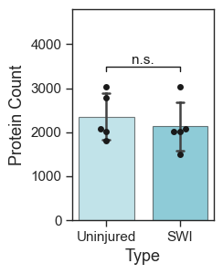
    <figcaption></figcaption>
    </figure>

    </div>

=== "Venn diagram"

    A Venn diagram provides a simple view of proteins unique to each condition and those shared between them. We can also extract the lists of proteins in each category by accessing the returned venn_contents.

    ```py title="Plot overlap between conditions"
    fig, ax = plt.subplots(figsize=(3, 3))
    ax, venn_contents = scplt.plot_venn(
        ax,
        dataset,
        classes="condition",
        set_colors=["#84C8D5", "#1F98B1"],
        return_contents=True,
    )
    plt.rcParams.update({"font.size": 12})  # run twice if font size does not update
    plt.show()

    setUninjured = set(venn_contents["Uninjured"])
    setSWI = set(venn_contents["SWI"])
    venn_df = pd.DataFrame({
        "Uninjured_only": pd.Series(sorted(setUninjured - setSWI)),
        "SWI_only": pd.Series(sorted(setSWI - setUninjured)),
        "Both": pd.Series(sorted(setSWI & setUninjured)),
    })
    ```

    <div class="result" markdown>

    <figure markdown="span">
    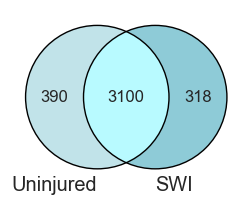
    <figcaption></figcaption>
    </figure>

    </div>

=== "Protein abundance"

    We can also directly visualize the abundance of specific proteins across conditions.  
    The helper function `plot_abundance_boxgrid()` provides a convenient way to display violin/box/bar-style abundance plots with sample-level points.

    If you want to access the underlying data directly, `.get_abundance()` returns a dataframe containing the abundance values.

    ```py title="Extract abundance dataframe"
    abundance_itgam_cd68 = pdata_sc_norm.get_abundance(
        namelist=["Itgam", "Cd68"],
        classes="condition",
    )

    abundance_itgam_cd68  # columns: abundance, log2_abundance, gene, Class
    ```

    <div class="result" markdown>

    | index | cell                                  | accession | abundance | class      | ... |
    |------:|---------------------------------------|-----------|-----------|------------|-----|
    | 0 | 20240601_Aur60minDIA_S12_astrocyte_J11 | P05555 | -19.931569 | Uninjured | ... |
    | 1 | 20240601_Aur60minDIA_S12_astrocyte_J12 | P05555 | -19.931569 | Uninjured | ... |
    | 2 | 20240601_Aur60minDIA_S12_astrocyte_J10 | P05555 | -19.931569 | Uninjured | ... |
    | 3 | 20240601_Aur60minDIA_S12_astrocyte_J15 | P05555 | -19.931569 | Uninjured | ... |
    | 4 | 20240601_Aur60minDIA_S12_scartissue_K10 | P05555 | 20.261621 | SWI | ... |

    </div>

    ```py title="Plot abundance using box + points"
    text_kwargs = dict(
        fontsize=11,
        color="black",
        offset=1,
    )

    figsize = (2, 2.5)

    fig, ax = pdata_sc_norm.plot_abundance_boxgrid(
        namelist=["Itgam", "Cd68"],
        classes="condition",
        plot_type="box",
        log_scale=True,
        figsize=figsize,
        text_kwargs=text_kwargs,
        palette=condition_color,
    )
    plt.show()
    ```

    <div class="result" markdown>

    <figure markdown="span">
    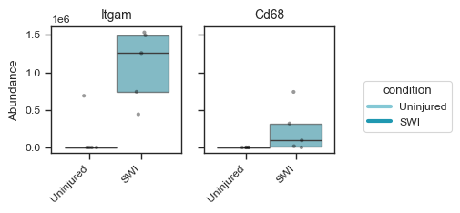
    <figcaption></figcaption>
    </figure>

    </div>

    ```py title="Alternative style with bar"
    figsize = (2, 2.5)
    bar_kwargs = {"width": 0.15}

    fig, ax = pdata_sc_norm.plot_abundance_boxgrid(
        namelist=["Itgam", "Cd68"],
        classes="condition",
        plot_type="bar",
        log_scale=True,
        figsize=figsize,
        bar_kwargs=bar_kwargs,
        palette=condition_color,
    )
    plt.show()
    ```

    <div class="result" markdown>

    <figure markdown="span">
    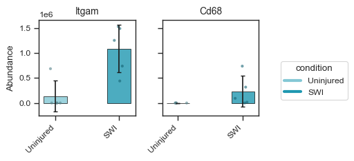
    <figcaption></figcaption>
    </figure>

    </div>

    The same panels support **significance brackets**: pass `sig_pairs` to run pairwise tests between groups and draw p-value annotations on the plot. With exactly two conditions, `sig_pairs=True` compares them automatically.

    ```py title="Boxgrid with significance brackets"
    fig, axes = pdata_sc_norm.plot_abundance_boxgrid(
        namelist=["Itgam", "Cd68"],
        classes="condition",
        plot_type="box",
        figsize=figsize,
        sig_pairs=True,
        palette=condition_color,
    )
    plt.show()
    ```

    <div class="result" markdown>

    <figure markdown="span">
    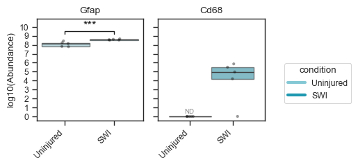
    <figcaption>Boxgrid panel with pairwise significance brackets.</figcaption>
    </figure>

    </div>

    See the [Plotting tutorial — Significance brackets](plotting.md#boxgrid-significance) for explicit multi-group pairs, shared groups in several comparisons, and `sig_kwargs` (test method, bracket styling).

### PCA

PCA reduces the high-dimensional protein abundance matrix into a smaller number of orthogonal components that capture the largest sources of variance in the dataset. We can color cells by (multiple) discrete sample class or by the abundance of a selected protein. For more options with coloring and marker shapes, see the [API reference](https://gnaprs.github.io/scpviz/reference/plotting/#src.scpviz.plotting.plot_pca). For **tuple-key `mapping`** (combined metadata styling) and **sequential overlay** examples on the same axes, see the [Plotting tutorial](plotting.md#pca-and-umap-tuple-key-mapping).

=== "2D PCA by class"

    ```py title="Plot 2D PCA colored by condition"
    fig, ax = plt.subplots(1, 1, figsize=(3, 3))
    ax = scplt.plot_pca(
        ax,
        pdata_sc_norm,
        color=["condition"],
        s=20,
        alpha=.8,
        pca_params={"n_comps": 9},
        force=True,
        cmap=condition_color,
        add_ellipses=False,
    )
    scplt.shift_legend(ax)
    plt.show()
    ```

    <div class="result" markdown>

    <figure markdown="span">
    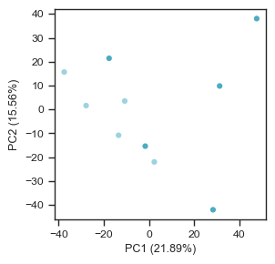
    <figcaption></figcaption>
    </figure>

    </div>

=== "2D PCA by abundance"

    ```py title="Plot 2D PCA colored by protein abundance (linear colorbar)"
    fig, ax = plt.subplots(1, 1, figsize=(3, 3))
    ax = scplt.plot_pca(
        ax,
        pdata_sc_norm,
        color="Itgam",
        cmap="plasma",
        s=20,
        alpha=.8,
        force=True,
    )
    scplt.shift_legend(ax)
    plt.show()
    ```
    <div class="result" markdown>

    <figure markdown="span">
    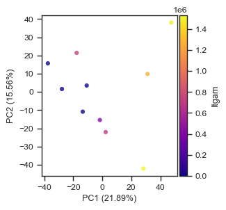
    <figcaption></figcaption>
    </figure>

    </div>

=== "2D PCA by abundance (log scale)"

    For sparse markers such as ITGAM, many cells have zero or missing abundance. Use
    ``colorbar_norm=mcolors.LogNorm(...)`` to emphasize differences among detected cells,
    and ``nan_color`` to plot undetected cells underneath the colormap layer.

    ```py title="Plot 2D PCA with LogNorm colorbar and black missing cells"
    import matplotlib.colors as mcolors

    fig, ax = plt.subplots(1, 1, figsize=(3, 3))
    ax = scplt.plot_pca(
        ax,
        pdata_sc_norm,
        color="Itgam",
        cmap="plasma",
        colorbar_norm=mcolors.LogNorm(vmin=1, vmax=1e7),
        nan_color="grey",
        s=20,
        alpha=.8,
        force=True,
    )
    scplt.shift_legend(ax)
    plt.show()
    ```

    <div class="result" markdown>

    <figure markdown="span">
    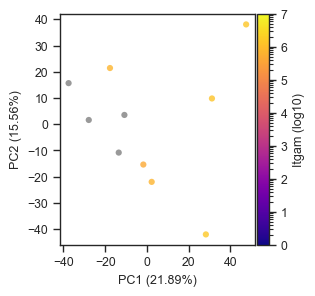
    <figcaption></figcaption>
    </figure>

    </div>

=== "3D PCA by class"

    ```py title="Plot 3D PCA colored by condition"
    fig = plt.figure(figsize=(5, 5))
    ax = fig.add_subplot(111, projection="3d")
    ax = scplt.plot_pca(
        ax,
        pdata_sc_norm,
        color=["condition"],
        force=True,
        plot_pc=[1, 2, 3],
        cmap=condition_color,
    )
    zlab = ax.get_zlabel()
    ax.set_zlabel("")
    ax.text2D(
        1.05,
        0.55,
        zlab,
        transform=ax.transAxes,
        rotation=90,
        ha="left",
        va="center",
        fontsize=9.5,
    )
    scplt.shift_legend(ax)
    plt.show()
    ```

    <div class="result" markdown>

    <figure markdown="span">
    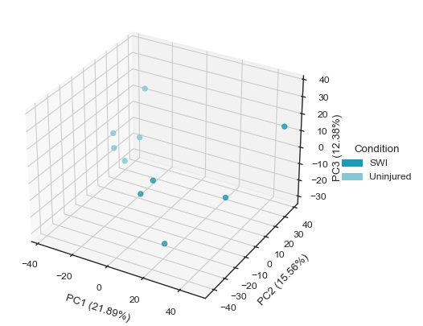
    <figcaption></figcaption>
    </figure>

    </div>

=== "3D PCA by abundance"

    ```py title="Plot 3D PCA colored by protein abundance"
    fig = plt.figure(figsize=(5, 5))
    ax = fig.add_subplot(111, projection="3d")
    ax = scplt.plot_pca(
        ax,
        pdata_sc_norm,
        color="Itgam",
        cmap="plasma",
        force=True,
        plot_pc=[1, 2, 3],
    )
    zlab = ax.get_zlabel()
    ax.set_zlabel("")
    ax.text2D(
        1.05,
        0.55,
        zlab,
        transform=ax.transAxes,
        rotation=90,
        ha="left",
        va="center",
        fontsize=9.5,
    )
    scplt.shift_legend(ax)
    plt.show()
    ```

    <div class="result" markdown>

    <figure markdown="span">
    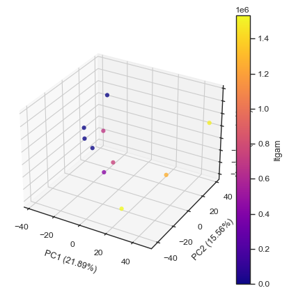
    <figcaption></figcaption>
    </figure>

    </div>

### UMAP

UMAP is another useful low-dimensional embedding method for single-cell proteomics data. Compared with PCA, UMAP often captures local neighborhood relationships between cells more effectively, and is often helpful for visualizing cell-state separation or potential subpopulations.

`scpviz` includes UMAP plotting through `plot_umap()`. Internally, UMAP uses a nearest-neighbor graph (`neighbor()`) built from PCA-reduced data (`pca()` or `harmony()`), so both the neighbor settings and UMAP settings can affect the final embedding.

The main parameters can be passed through `umap_params`, including:

- `n_neighbors` - neighbor graph parameter controlling local connectivity
- `min_dist` - UMAP parameter controlling how tightly points are packed
- `metric` - neighbor graph distance metric
- `spread` - UMAP parameter controlling overall embedding scale
- `random_state` - random seed for reproducibility
- `n_pcs` - number of principal components used to build the neighbor graph

For datasets with stronger batch effects, `scpviz` also supports Harmony integration through `pdata.harmony()`. This method applies Harmony-based batch correction using `scanpy.external.pp.harmony_integrate` on PCA-reduced protein or peptide data before downstream visualization.

=== "UMAP by class"

    ```py title="Plot UMAP colored by condition"
    fig, ax = plt.subplots(1, 1, figsize=(3, 3))
    umap_params = {"min_dist": 0.3, "n_neighbors": 7}

    ax = scplt.plot_umap(
        ax,
        pdata_sc_norm,
        classes=["condition"],
        s=20,
        alpha=.8,
        force=True,
        umap_params=umap_params,
        cmap=condition_color,
    )
    scplt.shift_legend(ax)
    plt.show()
    ```

    <div class="result" markdown>

    <figure markdown="span">
    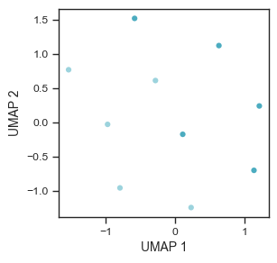
    <figcaption></figcaption>
    </figure>

    </div>

=== "UMAP by abundance"

    ```py title="Plot UMAP colored by protein abundance (linear colorbar)"
    fig, ax = plt.subplots(1, 1, figsize=(3, 3))
    umap_params = {"min_dist": 0.3, "n_neighbors": 7}

    ax = scplt.plot_umap(
        ax,
        pdata_sc_norm,
        color="Itgam",
        cmap="plasma",
        s=20,
        alpha=.8,
        force=True,
        umap_params=umap_params,
    )
    scplt.shift_legend(ax)
    plt.show()
    ```

    <div class="result" markdown>

    <figure markdown="span">
    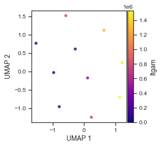
    <figcaption></figcaption>
    </figure>

    </div>

=== "UMAP by abundance (log scale)"

    ```py title="Plot UMAP with LogNorm colorbar and black missing cells"
    import matplotlib.colors as mcolors

    fig, ax = plt.subplots(1, 1, figsize=(3, 3))
    umap_params = {"min_dist": 0.3, "n_neighbors": 7}

    ax = scplt.plot_umap(
        ax,
        pdata_sc_norm,
        color="Itgam",
        cmap="plasma",
        colorbar_norm=mcolors.LogNorm(vmin=1, vmax=1e7),
        nan_color="black",
        s=20,
        alpha=.8,
        force=True,
        umap_params=umap_params,
    )
    scplt.shift_legend(ax)
    plt.show()
    ```

    <div class="result" markdown>

    <figure markdown="span">
    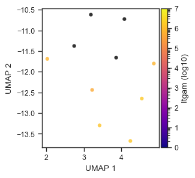
    <figcaption></figcaption>
    </figure>

    </div>

## Differential expression

Differential expression (DE) analysis can be used to identify proteins that differ between biological conditions. In this example, we compare **SWI** against **Uninjured** cells.

```py title="Define comparison groups"
case_values = [{"condition": "SWI"}, {"condition": "Uninjured"}]

color_dict = {
    "upregulated": condition_color["SWI"],
    "downregulated": condition_color["Uninjured"],
    "not_significant": "#FFFFFF6A",
}
```

A common way to visualize DE results is with a **volcano plot**, which shows the relationship between **fold change** and **statistical significance**.

!!! tip "Donor-blocked DE"
    When the same donors (animals, cases, …) contribute cells to both conditions, ordinary two-group tests can overstate significance. scpviz can account for that donor structure with a **mixed-effects / pseudobulk** model via [`pdata.mixed_de()`](https://gnaprs.github.io/scpviz/reference/pAnnData/analysis_mixin/#src.scpviz.pAnnData.analysis.AnalysisMixin.mixed_de) — see the [Differential Expression](de.md#donor-blocked-mixed-de-mixed_de) tutorial.

`scpviz` supports multiple fold-change calculation modes:

- `mean` - compare the mean abundance between groups; this is the default
- `pairwise_median` - compute fold changes across all possible sample pairs and take the median
- `pep_pairwise_median` - compute peptide-level pairwise fold changes per protein and take the median; this is similar to the approach used in Proteome Discoverer

The pairwise-based methods can sometimes be more robust to variation, but for single-cell datasets they may be less reliable if the data are too sparse. In this example, we compute differential expression for each protein across the two groups.

```py title="Plot volcano plot"
fig, ax = plt.subplots(figsize=(4, 4))
ax, volcano_df = scplt.plot_volcano(
    ax,
    pdata_sc_norm,
    values=case_values,
    threshold=0.05,
    return_df=True,
    color=color_dict,
    fold_change_mode="mean",
    label=[10, 5],
)

ax.set_ylabel("$log_{10}$ p value", fontsize=13, labelpad=4)
ax.set_xlabel("$log_{2}$ fold change", fontsize=13, labelpad=4)
ax.tick_params(axis="x", labelsize=11)
ax.tick_params(axis="y", labelsize=11)

plt.show()
```

<div class="result" markdown>

```text title="output" hl_lines="7"
🧭 [USER] Running differential expression [protein]
   🔸 Comparing groups: [{'condition': 'SWI'}] vs [{'condition': 'Uninjured'}]
   🔸 Group sizes: 5 vs 5 samples
   🔸 Method: ttest | Fold Change: mean | Layer: X
   🔸 P-value threshold: 0.05 | Log2FC threshold: 1
     ℹ️ [INFO] 413 proteins were not comparable (zero or NaN mean in one group).
     ✅ DE complete. Results stored in:
       • .stats["[{'condition': 'SWI'}] vs [{'condition': 'Uninjured'}]"]
       • Columns: log2fc, p_value, significance, etc.
       • Upregulated: 86 | Downregulated: 88 | Not significant: 2605
```

</div>

<div class="result" markdown>

<figure markdown="span">
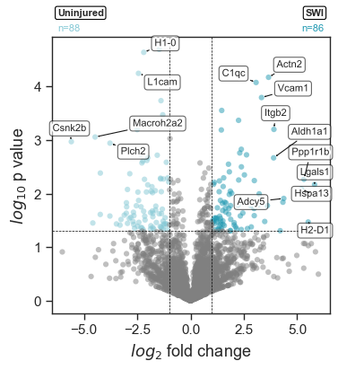
<figcaption></figcaption>
</figure>

</div>

Here, `label=[10, 5]` controls how many protein labels are shown on the plot from each side of the distribution. In this case, the plot will annotate the top **10** proteins on one side and **5** on the other, based on the internal ranking used for labeling.

Because single-cell data can be sparse, DE results should be interpreted with some care. In practice, it is often useful to combine DE with abundance plots, detection-rate filtering, or downstream enrichment analysis to focus on the most biologically meaningful candidates.

Access the DE results stored in `.stats` under the key shown in the output including **log₂ fold change**, **p-value**, and **significance score**.
```py title="Access DE results"
pdata_sc_norm.stats["[{'condition': 'SWI'}] vs [{'condition': 'Uninjured'}]"]
```

### STRING enrichment

We can perform **STRING enrichment** on the sets of up- and downregulated proteins from our DE analysis. First, list the available enrichment keys:

```py title="List enrichment keys"
pdata_sc_norm.list_enrichments()
```

<div class="result" markdown>

```text title="output" hl_lines="4"
🧭 [USER] Listing STRING enrichment status

     ℹ️ Available DE comparisons (not yet enriched):
        - SWI vs Uninjured

  🔹 To run enrichment:
      pdata.enrichment_functional(from_de=True, de_key="...")

✅ Completed STRING enrichment results:
    (none)

✅ Completed STRING PPI results:
    (none)
```

</div>

Since we just ran a DE analysis, the key **`SWI vs Uninjured`** is available. We can run STRING **functional enrichment** on both up- and downregulated proteins.

```py title="STRING functional enrichment"
pdata_sc_norm.enrichment_functional(from_de=True, de_key="SWI vs Uninjured")
```

<div class="result" markdown>

```text title="output" hl_lines="23"
🧭 [USER] Running STRING enrichment [DE-based: [{'condition': 'SWI'}] vs [{'condition': 'Uninjured'}]]

🔹 Up-regulated proteins
     ℹ️ Found 0 cached STRING IDs. 86 need lookup.
     🌐 [API] UniProt mapped: 82 / 86
     🌐 [API] STRING mapped: 0 / 4 (missing after UniProt)
          ℹ️ Cached 82 STRING ID mappings.
   🔸 Proteins: 86 → STRING IDs: 82
   🔸 Species: 10090 | Background: None
     ✅ [OK] Enrichment complete (7.11s)
   • Access result: pdata.stats['functional']["SWI vs Uninjured_up"]["result"]
   • Plot command : pdata.plot_enrichment_svg("SWI vs Uninjured", direction="up")
   • View online  : https://string-db.org/cgi/network?identifiers=10090.ENSMUSP00000020277%0d10090...ENSMUSP00000030187&caller_identity=scpviz&species=10090&show_query_node_labels=1


🔹 Down-regulated proteins
     ℹ️ Found 0 cached STRING IDs. 88 need lookup.
     🌐 [API] UniProt mapped: 83 / 88
     🌐 [API] STRING mapped: 1 / 5 (missing after UniProt)
          ℹ️ Cached 84 STRING ID mappings.
   🔸 Proteins: 88 → STRING IDs: 84
   🔸 Species: 10090 | Background: None
     ✅ [OK] Enrichment complete (5.09s)
   • Access result: pdata.stats['functional']["SWI vs Uninjured_down"]["result"]
   • Plot command : pdata.plot_enrichment_svg("SWI vs Uninjured", direction="down")
   • View online  : https://string-db.org/cgi/network?identifiers=10090.ENSMUSP00000105980%0d10090...caller_identity=scpviz&species=10090&show_query_node_labels=1

```

</div>

Once enrichment is complete, you can visualize the **Gene Ontology (Biological Process)** results:

```py title="Plot enrichment"
pdata_sc_norm.plot_enrichment_svg("SWI vs Uninjured", direction="down")
```

<div class="result" markdown>
<figure markdown="span">
  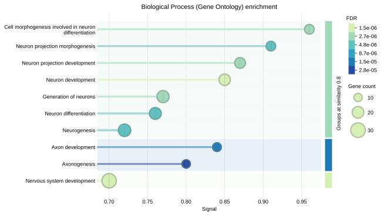
  <figcaption></figcaption>
</figure>

</div>

!!! note
    Refer to the [Enrichment](enrichment.md) tutorial for details on additional STRING features such as **PPI networks**, **GSEA**, and **combined enrichment-PPI analyses**.

## Using scanpy

`scpviz` is designed to work well with external single-cell analysis tools. In particular, the `.prot` and `.pep` attributes are standard `AnnData` objects, so once the data are prepared, they can be used directly with functions from packages such as **scanpy**.

Before using `scanpy`, it is important to clean the data matrix because `scanpy` generally expects **0 values rather than `NaN`s** in `.X`. If `NaN`s are left in place, many `scanpy` functions will raise errors.

```py title="Clean pdata for scanpy compatibility"
pdata_sc_norm.clean_X()
```

<div class="result" markdown>

```text title="output"
🧭 [USER] Cleaning prot data: making scanpy compatible, replacing NaNs with 0 in .X.
     ℹ️ [INFO] Backed up .X to .layers['X_preclean']
     ✅ [OK] Cleaned .X: replaced 690 NaNs with 0.
```

</div>

Once cleaned, you can work directly with `pdata_sc_norm.prot` or `pdata_sc_norm.pep`, depending on whether you want to analyze protein-level or peptide-level data.

For example, the protein-level matrix can be passed directly into a standard `scanpy` workflow:

```py title="Run a basic scanpy workflow on protein data"
sc.pp.scale(pdata_sc_norm.prot)
sc.tl.pca(pdata_sc_norm.prot, svd_solver="arpack")
sc.pp.neighbors(pdata_sc_norm.prot)

sc.tl.leiden(
    pdata_sc_norm.prot,
    flavor="leidenalg",
    n_iterations=2,
    resolution=2,
)

sc.tl.umap(pdata_sc_norm.prot)

sc.pl.umap(
    pdata_sc_norm.prot,
    color=["condition", "leiden"],
    size=100,
)

sc.tl.dendrogram(pdata_sc_norm.prot, groupby="condition")

sc.tl.rank_genes_groups(
    pdata_sc_norm.prot,
    groupby="condition",
    method="wilcoxon",
)

sc.pl.rank_genes_groups_dotplot(
    pdata_sc_norm.prot,
    n_genes=10,
    swap_axes=False,
    gene_symbols="Genes",
)
```

<div class="result" markdown>
<figure markdown="span">
  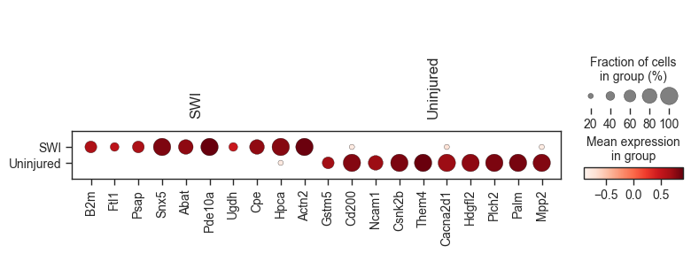
  <figcaption></figcaption>
</figure>

</div>

This makes it straightforward to use `scpviz` for preprocessing and proteomics-specific handling, while still taking advantage of the broader single-cell ecosystem for clustering, neighborhood graph construction, marker ranking, and visualization.

!!! note
    See the [scanpy tutorials](https://scanpy.readthedocs.io/en/stable/tutorials/index.html) for additional examples and workflows that can be applied directly to `pdata_sc_norm.prot` or `pdata_sc_norm.pep`.

## Next steps

Further analyses that can be performed on single-cell proteomics data include:

- clustering using scanpy or other single-cell frameworks  
- trajectory or pseudotime analysis  
- pathway enrichment of differentially expressed proteins  
- integration with transcriptomic single-cell datasets

Because `scpviz` stores data in standard AnnData objects, it can be easily combined with tools from the broader single-cell ecosystem.
