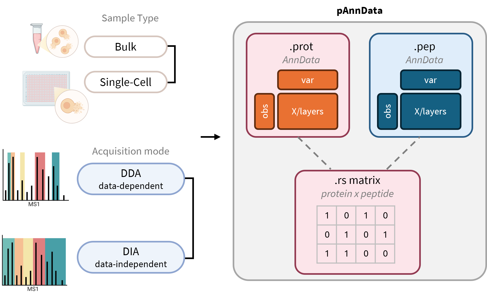

# Summary
Proteomics seeks to characterize protein dynamics by measuring both protein abundance and post-translational modifications (PTMs), such as phosphorylation, acetylation, and ubiquitination, which regulate protein activity, localization, and interactions. In bottom-up proteomics workflows, proteins are enzymatically digested into peptides that are measured as spectra, from which these peptide-spectrum matches (PSMs) are aggregated to infer protein-level identifications and quantitative abundance estimates. Analyzing the two levels of data at both the peptide level (short fragments observed directly) and the protein level (assembled from peptide evidence) in tandem is crucial for translating raw measurements into biologically interpretable results.

Single-cell proteomics extends these approaches to resolve protein expression at the level of individual cells or microdissected tissue regions. Such data are typically sparse, with many missing values, and are generated within complex experimental designs involving multiple classes of samples (e.g., cell type, treatment, condition). These properties distinguish single-cell proteomics from bulk experiments and create unique challenges in data processing, normalization, and interpretation. The single-cell transcriptomics community has established a mature ecosystem for managing similar challenges, exemplified by the `scanpy` package [@SCANPY:2018] and the broader `scverse` ecosystem [@virshupScverseProjectProvides2023a]. Building on these foundations, `scpviz` extends the AnnData data structure to the domain of proteomics, supporting a complete analysis pipeline from raw peptide-level data to protein-level summaries and downstream interpretation through differential expression, enrichment analysis, and network analysis. The core of `scpviz` is the `pAnnData` class, an `AnnData`-affiliated data structure specialized for proteomics. Together, these components make `scpviz` a comprehensive and extensible framework for single-cell proteomics. By combining flexible data structures, reproducible workflows, and seamless integration with the `AnnData`, `scanpy` and extended `scverse` ecosystem, the package enables researchers to efficiently connect peptide-level evidence to protein-level interpretation, thereby accelerating methodological development and biological discovery in proteomics.

# Statement of need
Although general-purpose data analysis frameworks such as `scanpy` [@SCANPY:2018] and the broader `scverse` ecosystem have become indispensable for single-cell transcriptomics, comparable tools for proteomics remain limited. Unlike transcriptomic data (counts, reads), proteomics measurements are inherently hierarchical. Peptide-level measurements provide the primary basis from which protein-level quantities are inferred, often with shared or ambiguous peptide assignments and strong reliance on peptide confidence. In addition, missing data is pervasive in low-input and single-cell experiments, further complicating representation and analysis using flat feature-by-sample abstractions.

Existing proteomics software typically focuses on upstream tasks such as peptide identification and protein quantification, producing tabular outputs that are not designed for iterative downstream analysis. As a result, users must rely on ad hoc data structures to perform filtering, normalization, visualization, and interpretation, limiting reproducibility and making it difficult to integrate proteomics data into modern single-cell analysis workflows. These limitations are amplified in single-cell and spatial contexts, where complex experimental designs, sparse measurements, and the need to compare across multiple biological conditions require flexible data management and metadata-aware analysis.

`scpviz` addresses this gap by providing a unified framework for organizing and analyzing proteomics data from raw peptide-level evidence through protein-level summaries and biological interpretation. It is designed for computational biologists and proteomics researchers working with low-input or single-cell datasets generated by common analysis pipelines such as Proteome Discoverer or DIA-NN [@demichevDIANNNeuralNetworks2020a]. By enabling structured downstream analysis and integration with established single-cell ecosystems, `scpviz` supports reproducible and scalable proteomics workflows and facilitates cross-modality analyses that connect protein-level measurements to broader systems-level biology.

# State of the field
A range of software tools exists for proteomics data processing and analysis, each addressing specific stages of the workflow. Upstream platforms such as Proteome Discoverer and DIA-NN [@demichevDIANNNeuralNetworks2020a] provide peptide identification, protein inference, quantitative estimation, and built-in visualization capabilities. However, these environments are primarily designed around fixed analysis pipelines focused on spectral processing and quantification, and offer limited flexibility for downstream data manipulation, including user-defined normalization strategies, imputation methods, and iterative exploratory analysis. As a result, they typically export tabular outputs intended for external analysis rather than serving as extensible frameworks for single-cell or spatial proteomics workflows.

For single-cell proteomics specifically, several tools have been developed to address downstream analysis needs. The `scp` Bioconductor package [@vanderaaCurrentStateSingleCell2023] provides a comprehensive R-based framework for processing and analyzing mass spectrometry-based single-cell proteomics data, built on `QFeatures` and `SingleCellExperiment`. Pipeline-oriented tools such as the SCoPE2 pipeline, SPP (Scripts and Pipelines for Proteomics), QuantQC, and SCeptre offer lab-specific workflows for particular acquisition designs (e.g. isobaric carrier, plexDIA, nPOP). While these tools address important upstream and QC needs, they are generally pipeline-specific, R-based, or tied to particular experimental designs.

Meanwhile, the Python-based single-cell ecosystem continues to grow rapidly, with the `scverse` framework [@virshupScverseProjectProvides2023a] establishing AnnData as a community standard for interoperable single-cell analysis. Python-native proteomics algorithms such as directLFQ [@ammarAccurateLabelFreeQuantification2023] for label-free quantification and PIMMS [@webelImputationLabelfreeQuantitative2024] for missing value imputation are increasingly available. Most recently, ProteoPy [@fichtnerProteoPyAnnDatabasedFramework2026] introduced an AnnData-based Python framework for bulk proteomics analysis. However, single-cell proteomics presents distinct challenges that bulk-oriented frameworks do not address: peptide-level information is critical not only for filtering (e.g. unique peptide thresholds, sparsity-aware filtering) but also for core quantification operations such as directLFQ normalization, which requires explicit peptide-protein relationships as input. Single-cell and spatial proteomics workflows therefore require a framework designed around these hierarchical relationships from the ground up, rather than adapted from bulk assumptions. `scpviz` addresses this by maintaining paired peptide- and protein-level AnnData objects linked by an explicit relationship matrix, enabling peptide-aware operations throughout the analysis workflow within a unified Python framework compatible with the broader `scverse` ecosystem.

While transcriptomics frameworks such as `scanpy` operate on a single level of abstraction (gene-level counts), proteomics analyses depend critically on peptide-level measurements for quantification, normalization, and confidence assessment, requiring extension to a hierarchical structure that existing frameworks do not natively support. With this in mind, `scpviz` was developed as a standalone framework to bridge this structural gap. Extending upstream proteomics software would not address downstream, metadata-aware analysis needs and is constrained in some cases by commercial software ecosystems, while embedding proteomics-specific logic directly into transcriptomics frameworks would introduce unnecessary complexity for transcriptomics use cases. By extending AnnData with a proteomics-specific data model that explicitly captures peptide–protein relationships, `scpviz` enables proteomics data to be analyzed within established single-cell workflows while preserving domain-specific rigor. This positions `scpviz` as connective infrastructure between proteomics and single-cell analysis ecosystems, rather than a replacement for existing tools.

# Software design

The design of `scpviz` centers on the `pAnnData` class, an `AnnData`-affiliated data structure specialized for proteomics. Rather than representing proteomics data as a single flat matrix, `pAnnData` accounts for the hierarchical relationship between peptide-level and protein-level measurements by pairing matched peptide (`.pep`) and protein (`.prot`) `AnnData` objects with supporting attributes such as `.summary`, `.metadata`, `.stats`, and a protein-peptide relationship (`.rs` matrix). This design allows users to preserve explicit peptide-protein relationships during downstream analyses, enabling operations like peptide-level protein abundance normalization or peptide-based fold-change aggregation for differential expression, while maintaining compatibility with established Python libraries for data science and visualization (\autoref{fig:overview}).

Proteomics-specific operations in `scpviz` are designed to operate uniformly across peptide and protein-level data. By organizing functionality into mixin-based classes that act on underlying `AnnData` objects, common operations such as filtering, normalization, imputation, and summarization can be applied consistently to both peptides and proteins. This object-oriented design reduces code duplication while ensuring that shared analytical logic respects proteomics-specific constraints at each level of representation. Visualization and analysis utilities (e.g. PCA, UMAP, clustermaps, abundance plots) build directly on these structured representations [@mcinnesUMAPUniformManifold2018a]. For downstream interpretation, `scpviz` integrates external resources such as UniProt for annotation and STRING database for functional enrichment and network analysis [@szklarczykSTRINGDatabase20232023; @snelSTRINGWebserverRetrieve2000], and incorporates proteomics-specific quantification strategies such as directLFQ [@ammarAccurateLabelFreeQuantification2023]. By retaining AnnData compatibility, `pAnnData` objects can be used directly with tools such as scanpy [@SCANPY:2018] and harmony [@korsunskyFastSensitiveAccurate2019a], enabling direct incorporation into established single-cell workflows.

Design decisions in `scpviz` emphasize separation between data representation and analytical operations. Core data structures encode peptide–protein relationships and metadata, while higher-level methods implement proteomics-aware transformations that can be composed, extended, or replaced. This modular architecture enables users to adapt the framework to evolving experimental designs without coupling downstream analysis logic to upstream data processing assumptions. The design philosophy of `scpviz` thus emphasizes both usability and extensibility. General users can rely on its streamlined API to import, process, and visualize single-cell proteomics data without deep programming expertise, while advanced users can extend the framework to accommodate custom analysis pipelines.

# Research impact statement
`scpviz` has already been used in the analysis of multiple published studies and preprints across single-cell and bulk proteomics applications [@Pang:2025; @DuttaPang:2025; @Uslan:2025; @duttaParkinsonsDiseaseModeling2025]. In these works, the framework enabled structured downstream analysis of peptide and protein-level data, including differential expression, functional enrichment, and integration with transcriptomic measurements.

The development of `scpviz` has been shaped by close collaboration with staff scientists and users of the Proteome Exploration Laboratory (PEL) at Caltech, a shared mass spectrometry facility serving research groups across campus. Feedback from PEL staff and facility users directly informed the design and feature set of the package, ensuring that `scpviz` addresses practical needs across a range of single-cell and bulk proteomics workflows. In addition, `scpviz` has been incorporated into graduate-level training to demonstrate how proteomics workflows can be analyzed using pipelines common in single-cell transcriptomics analysis, lowering the barrier for new users entering the field.

The primary impact of `scpviz` lies in providing reusable infrastructure rather than task-specific analyses. By formalizing peptide–protein relationships within an `AnnData`-compatible data model, the package enables proteomics data to be analyzed using established single-cell tools for visualization, integration, and exploratory analysis. This structured representation supports reproducible downstream workflows and directly enables multi-omics integration. Because `scpviz` represents proteomics data as standard AnnData objects, proteomics and transcriptomics datasets can be jointly analyzed using the broader `scverse` ecosystem without custom data wrangling. This capability was used in practice in [@DuttaPang:2025], where single-cell spatial proteomics data processed with `scpviz` was integrated with 10x scRNA-seq data from the Allen Brain Atlas mouse brain atlas. Both datasets were represented as AnnData objects, allowing direct cross-modality comparison of cortex-to-SNpc fold changes to benchmark competing normalization strategies, with directLFQ normalization showing substantially higher directional agreement between transcript ratios and protein log2 fold changes than median-based normalization with imputation. This cross-omics benchmarking approach using transcriptomic data as an orthogonal reference for evaluating proteomics preprocessing was made tractable by the shared `AnnData` data model, and illustrates the practical value of building proteomics infrastructure within an interoperable single-cell ecosystem.

`scpviz` is released as open-source software with comprehensive documentation, automated tests, and reproducible examples, supporting transparent and extensible research workflows. Its emphasis on interoperability with widely used single-cell analysis libraries positions it as infrastructure for continued method development as single-cell and spatial proteomics technologies mature and scale.

# AI usage disclosure
Generative AI tools were used during the development of this work to assist with code refactoring, documentation drafting, and manuscript text editing. All software design decisions, implementation, validation, and scientific interpretation were performed and reviewed by the authors. No generative AI tools were used to generate or analyze research data, and all results reported are reproducible from the publicly available source code and documentation.

# Acknowledgements

We thank Pierre Walker for his many insightful discussions and guidance. We also acknowledge support from the A*STAR BS-PhD Scholarship. The Proteome Exploration Laboratory is partially supported by the Caltech Beckman Institute Endowment Funds.

<!-- If you want to cite a software repository URL (e.g. something on GitHub without a preferred
citation) then you can do it with the example BibTeX entry below for @fidgit. -->   

<!-- Figures can be included like this:

and referenced from text using \autoref{fig:example}.

Figure sizes can be customized by adding an optional second parameter:
{ width=20% } -->

# References
